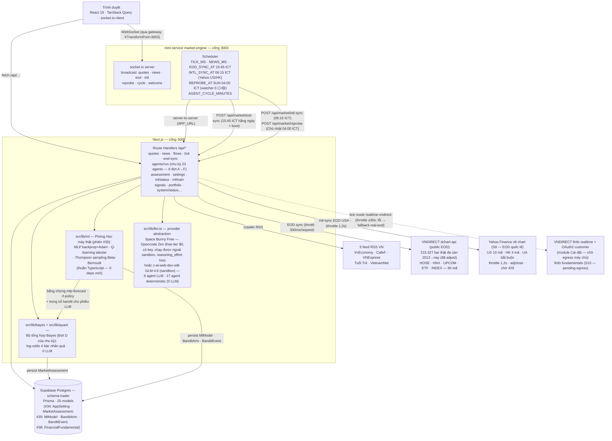

# The Trader

> **Dashboard multi-agent paper-trading cho VNDIRECT** — đội **23 agent AI chia 5 nhóm** (Nghiên cứu · Kiểm soát VETO · Điều hành · Nền tảng dữ liệu · Học máy) chạy **chu kỳ 6 đợt A→F** (Đợt D = **Bộ tổng hợp Bayes nhân quả** — log-odds 4 bậc trên dữ liệu thật, 0 LLM) phân tích realtime trên **dữ liệu giá EOD THẬT đa sàn** (phiên #38 — 90 instrument active HOSE/HNX/UPCOM + ETF/index, 215K bar 2013→nay qua dchart public API; quốc tế US/HK qua Yahoo Finance — chờ nguồn hồi 429), bảng giá group theo sàn, tin tức RSS thật, tín hiệu giao dịch + lệnh giấy, kèm audit trail đầy đủ. **Phòng Học máy chạy 3 thuật toán RL/DL THẬT** (phiên #35): MLP backprop+Adam · Q-learning tabular · Thompson sampling. **Cổng đồng thuận 80%** (6 cử tri — shadow-mode) + bảng điểm scorecard + ma trận độ phủ 15 ô (phiên #38).

**Next.js 16** · **TypeScript** · **Prisma + Supabase Postgres** · **shadcn/ui** · **Space Bunny Free** (Opencode Zen, free-tier $0, chạy được cả ngoài sandbox — mặc định cho toàn đội) / fallback **GLM-4.6** (trong sandbox Z.ai) · **socket.io** · **giá EOD thật đa sàn** (dchart VNDIRECT — 215.327 bar 2013→nay · Yahoo Finance cho US/HK) · **7 workspace** (Tổng quan · Thị trường · Danh mục · Tín hiệu · Đội Agent · Tổng hợp · Cài đặt) · **Bộ tổng hợp Bayes nhân quả** (Đợt D của chu kỳ — `src/lib/quant` + `src/lib/bayes`: OLS · Holt · lexicon NLP tiếng Việt · regime, 0 LLM) · **học máy RL/DL thật** (`src/lib/ml`: MLP dự báo 5 phiên · Q-learning 48 trạng thái · Thompson sampling Beta-Bernoulli — thuần TypeScript, 0 deps mới)

> **Miễn trừ trách nhiệm:** đây là dự án minh họa (demo). **Lịch sử giá EOD 2013→nay là dữ liệu THẬT** từ VNDIRECT dchart (đã adjust — 215.327 bar đa sàn: HOSE/HNX/UPCOM · ETF · index VN, 90 instrument active); giá intraday trong phiên vẫn **mô phỏng** quanh mức tham chiếu thật (random-walk + mean-reversion, gắn nhãn `simulated`; INDEX/quốc tế neo EOD thật) — trừ khi bật chế độ `realtime-vndirect` qua module Cài đặt (phiên #34, cần máy chủ có egress tới VNDIRECT): khi đó tick trong phiên lấy giá cuối thật finfo, lỗi mạng thì tự fallback quanh ref EOD thật + gắn nhãn `fallback`; dòng khối ngoại mô phỏng deterministic (khai báo rõ); EOD quốc tế US/HK chờ Yahoo Finance hồi phục rate-limit (job 06:15 ICT tự đổ); dữ liệu cơ bản finfo pending-egress; toàn bộ lệnh là **paper trading** — lệnh giấy nội bộ, không gửi ra môi giới; tin tức RSS là dữ liệu thật nhưng chỉ làm ngữ cảnh phân tích. Dự án **không** dùng để giao dịch tiền thật.

---

## Tính năng chính

- **App shell 7 workspace (phiên #34)** — **Tổng quan** (gọn: MarketSummary + AssessmentBrief + Signals compact + AgentSystemBrief) · **Thị trường** · **Danh mục** · **Tín hiệu** (feed + rủi ro + vận hành agents) · **Đội Agent** · **Tổng hợp** (Bộ tổng hợp Bayes) · **Cài đặt** (VNDIRECT) — Zustand, không reload trang, realtime không đứt; nav 7 tab cuộn ngang trên mobile (snap, ẩn scrollbar, mọi tab ≥44px); deep-link `?ws=` cho cả 7 workspace.
- **Bảng giá đa sàn group theo sàn (phiên #38)** — **90 instrument active**: HOSE-STOCK 30 · HNX-STOCK 20 · UPCOM-STOCK 13 · HOSE-ETF 5 · INDEX 8 (VNINDEX hiển thị điểm 1.753,39) · US 10 · HK 4 — nhóm HOSE→HNX→UPCOM→US→HK + nhóm Chỉ số, **định dạng giá theo UnitSpec** (nghìn ₫ · điểm · cents — không trộn đơn vị); tick mô phỏng 10s qua mini-service `market-engine` (WebSocket) **quanh mức tham chiếu THẬT** (close EOD dchart), tuân thủ quy tắc sàn: bội 100 VND, dải trần/sàn ±7% mở theo ref thật (INDEX/quốc tế neo EOD thật, không mô phỏng); **toggle cột mở rộng** (trần/sàn/tham chiếu/cao/thấp, dấu ⌃⌄ khi chạm trần/sàn); ngoài phiên bảng giá neo ở mức đóng cửa thật (mode `real`, `MARKET_STRICT_SESSION=true`). **Chế độ `realtime-vndirect` (phiên #34):** trong phiên kéo **giá cuối THẬT finfo VNDIRECT** (throttle ≥30s kèm cache, round100 + clamp ±7%, khối lượng dồn phiên thật), lỗi mạng → tự fallback random-walk quanh ref EOD thật + gắn nhãn `fallback`.
- **Biểu đồ nến Nhật + RSI14 trên dữ liệu EOD thật** — nến custom (xanh=đóng≥mở) + volume histogram màu phiên + panel RSI Wilder (guideline 30/70, vùng quá mua/bán); toggle Nến/Đường, khung 30/60/90 phiên; chuỗi OHLCV 2013→nay là **bar thật VNDIRECT dchart**.
- **23 AI agent (5 nhóm) — làm việc trực tiếp** — Nghiên cứu (5) · Kiểm soát VETO (3) · Điều hành (4) · Nền tảng dữ liệu (4) · Học máy (7): **6 agent gọi LLM mỗi chu kỳ** (market-analyst · fair-value · news-sentiment · liquidity · risk-manager · portfolio-strategist), **17 agent còn lại chạy deterministic từ DB** (0 chi phí LLM, ~0.2–1.5s); chu kỳ **6 đợt A→F** (Đợt D = Bộ tổng hợp Bayes — xem dưới); 4 LLM nghiên cứu + risk-manager giờ kèm **assessment JSON** `{direction, confidence, evidence[]}` làm phiếu bầu cho Bộ tổng hợp Bayes; roster UI chia 5 nhóm + badge VETO; **chạy riêng từng agent**, **chat 1-1** (AgentMessage.direction USER/AGENT), hồ sơ chi phí token/$ từng agent + sparkline 7 ngày, rate-limit 60s/agent có đếm ngược.
- **Bộ tổng hợp Bayes nhân quả (phiên #34 — workspace Tổng hợp)** — **Đợt D** của chu kỳ, chạy giữa Ủy ban Kiểm soát và Chủ tịch: engine **log-odds naive Bayes 4 bậc nhân quả** (Bậc 0 tiên nghiệm base-rate **250 phiên thật · 7.500 quan sát** → Bậc 1 thị trường: breadth · lexicon NLP tiếng Việt (~75 thuật ngữ + phủ định) · dòng khối ngoại · Holt double exponential · regime → Bậc 2 ngành → Bậc 3 cổ phiếu kế thừa posterior thị trường), clamp LR [0.5, 3] · weight [0.3, 1] · |L|≤4; **sensitivity Δlog-odds → drivers**, disagreement, narrative tiếng Việt tự sinh; phiếu bầu LLM có trọng số healthScore/successRate; forecast 5 phiên Holt kèm CI80; VETO Ủy ban Kiểm soát vẫn là ràng buộc cứng, banner phủ quyết ngay trên nhận định; **0 LLM — $0** (`GET /api/assessment` · `POST /api/assessment/synthesize` cooldown 10s).
- **Học máy RL/DL THẬT (phiên #35 + #81 — `src/lib/ml`, 0 deps mới)** — 3 thuật toán thuần TypeScript chạy trong code (7/7 agent Phòng Học máy vận hành thật, hết stub): **MLP deep learning** dự báo hướng giá 5 phiên (**arch tham số hoá 16→24→12→3 = 747 tham số — bộ đặc trưng v2-lag16 #81: 10 chiều gốc + 6 chiều lag/đạo hàm (r_lag1/2/3 · ΔRSI5 · Δvolz5 · độ dốc SMA20)**, He init, cross-entropy class-weight, backprop tay + Adam, batch 32, early-stop, split 80/20 theo thời gian, seed 42 deterministic — đo thật trên **60.000 mẫu EOD thật**: **valAcc 39,4%** vs random 33,3% · ~11-14s train) · **Q-learning tabular 48 trạng thái × 3 hành động** (α 0,1 · γ 0,95 · ε 1→0,05 · **300 episodes**) tham mưu phơi nhiễm danh mục · **Thompson sampling Beta-Bernoulli 6 arms** tự học trọng số phiếu LLM (reward = phiếu đúng hướng giá thực tế sau 5 phiên, FLAT khớp 0,7); card "Học máy & Học tăng cường" trong workspace Tổng hợp + nút **Huấn luyện** (`GET /api/ml/status` · `POST /api/ml/train` cooldown 60s + mutex → 429 Retry-After); **vòng học ML-Ops tự vận hành từ #79 (Giai đoạn A)**: settle bandit 16:15 ICT hằng ngày (`POST /api/ml/settle` + AuditLog `ML_SETTLE`) · retrain Chủ nhật 04:00 ICT với skip-guard windowHash + serving-swap guard (valAcc thua bản serving **hoặc cổng B2 chưa mở cho bộ đặc trưng mới** → bản mới chỉ archived, toast nói đúng lý do `promotionReason`) · tab scorecard "Hiệu năng & calibration" (Wilson 95% CI · Brier Murphy · calibration 5 mức · ma trận agent × regime · `GET /api/ml/analytics`) · badge Drift PSI trên ml-panel; **Giai đoạn B #81**: **cổng bằng chứng chuỗi** `scripts/ml-evidence-gate.ts` (autocorr lag 1-5 + rank-IC Spearman 16 đặc trưng + ΔBrier paired bootstrap 1.000× trên cùng windowHash — deterministic) — **verdict đo thật 10-10: FAIL** (ΔBrier CI [+0,0046; +0,0079] > 0 · 0/6 đặc trưng mới có ý nghĩa) → UI hiển thị trung thực "Cổng chuỗi: CHƯA mở" + **GRU-24 giọng thứ ba bị khoá theo B4** (`gru.ts` BPTT viết tay sẵn sàng, chỉ train khi verdict PASS — `POST /api/ml/train {target:"dl-gru"}` chặn 400), serving giữ v8-lag10; bằng chứng `mlp-forecast` + `rl-policy` chảy vào Bộ tổng hợp Bayes (46→50 bằng chứng); **L1 BM25 RAG #83 (`src/lib/ml/rag.ts` — ML_LEARNING_BLUEPRINT §2)**: tri thức truy hồi viết tay — corpus 500 tin broadcast + 200 tin tức, xếp hạng **0,7·BM25 + 0,3·độ tươi** (nửa đời 3 ngày), top-8 tiêm prompt **5 agent nghiên cứu + Chủ tịch** mỗi chu kỳ (≤1.200 token, cap 3.000 ký tự — đo thật 3ms xếp hạng 700 docs), model `RetrievalLog` ghi mỗi lần truy hồi (dữ liệu cổng L3 pgvector: ≥30 ngày & ≥10% chu kỳ), A13 nâng cấp báo cáo usage, ml/status field `rag` + UI khối "Tri thức truy hồi (L1)"; **bảng `IntradayBar` 5-phút #83**: tick 10s trong phiên tự gom thành bar OHLCV 5-phút (`src/lib/intraday.ts` — bucket floor UTC, volume delta, source trung thực simulated/realtime-finfo, tickCount độ phủ) + `GET /api/market/intraday?symbol=VCB` + ml/status field `intraday` — **độ phân giải chuỗi giá thứ hai** mở đường re-đo cổng bằng chứng B2 cho GRU khi đủ dữ liệu (thu thập bắt đầu từ phiên giao dịch kế tiếp).
- **Cổng đồng thuận 80% + scorecard + ma trận độ phủ (phiên #38 — MARKET_EXPANSION_BLUEPRINT)** — **ml-forecast thành cử tri thứ 6** (ensemble MLP 0,7 + linreg 0,3) → **6 cử tri** bầu theo số đông với trọng số clamp(health/100×posteriorMean, 0,3, 1); cổng 3 mức ĐỒNG THUẬN ≥80% · ĐA SỐ YẾU 50–79,9% · KHÔNG ĐỒNG THUẬN <50% (VETO vẫn tối thượng, pool<4 fail-safe) — **shadow-mode** (mặc định, tự bật enforcement sau 10 chu kỳ shadow) snapshot vào từng tín hiệu; **bảng điểm Hội đồng Nghiên cứu** (hit-rate · Brier · đóng góp posterior · streak — tab Đội Agent, "chưa đủ dữ liệu" khi <5 pulls) + **ma trận độ phủ 15 ô 3 sàn × 5 loại + quốc tế + cơ bản** (3 màu real/empty/pending-source trung thực); Bộ tổng hợp Bayes thêm **5 segment VN + composite** + segment INTERNATIONAL (tham khảo); bảng chỉ báo top-10 HOSE thêm 4 cột MACD hist · %B · ATR14% · Stoch %K.
- **Module Cài đặt (phiên #34)** — nhập cấu hình **VNDIRECT** (consumer key/secret/access token/số tài khoản; secret mask 4 ký tự đầu + ····; bỏ trống = giữ, `""` = xoá) + **Kiểm tra kết nối thật** (OAuth2 `auth.vndirect.com.vn` + finfo) + chọn **mode dữ liệu runtime** `real-eod` | `realtime-vndirect` | `simulated` (bảng `AppSetting` ghi đè env, không cần restart) — mode realtime chưa cấu hình/lỗi fetch → tự fallback `real-eod` an toàn, UI badge "Đang fallback: EOD thật".
- **Human-in-the-loop phê duyệt** — chu kỳ sinh tín hiệu **ACTIVE chờ duyệt**; trader **✅ Phê duyệt** (lệnh paper LIMIT 5% NAV) hoặc **⛔ Từ chối** ngay trong feed tin nhắn / tab Tín hiệu; đầy đủ audit `SIGNAL_CREATED`/`SIGNAL_APPROVED`/`SIGNAL_REJECTED`.
- **Tin tức RSS thật** — crawler 5 nguồn Việt Nam (VnEconomy, CafeF, VNExpress, Tuổi Trẻ, VietnamNet), dedupe theo URL, nạp tay hoặc tự động mỗi 15 phút.
- **Dòng khối ngoại (S6)** — mô phỏng deterministic theo thanh khoản thật + cảnh báo `FOREIGN_FLOW_OUTFLOW` khi bán ròng mạnh.
- **Tín hiệu → lệnh giấy** — Signal → APPROVE/convert → lệnh PENDING (phí 0.15%, thuế TNCN 0.1% khi bán), fill engine tự khớp, danh mục vị thế + PnL runtime + **donut phân bổ ngành + cột % tỷ trọng**.
- **Chip CFO** — **Sức mua (ước tính)** công thức minh bạch ở header (cash + equity×0.5 − marginUsed); **chip chi phí AI lũy kế** (tổng $ + tokens) ở footer.
- **Watchlist cá nhân** — thêm/gỡ mã bằng cột sao, chuyển đổi nhanh VN30 ⇄ danh mục theo dõi.
- **Minh bạch nguồn dữ liệu** — mỗi nguồn gắn nhãn `live`/`real`/`simulated`/`fallback`/`paper` + stale marking, hiển thị trực tiếp trên footer (nguồn `eod-history` chạy mode `real` — dot xanh "EOD thật").
- **Audit trail đầy đủ** — `AgentRun` (token/chi phí/thời lượng), `AgentMessage`, `AuditLog` mọi hành động nhạy cảm (kể cả chat).
- **Dark terminal UI tiếng Việt** — quy ước màu xanh tăng/đỏ giảm (chuẩn thị trường VN), số liệu thẳng cột (tabular-nums), responsive mobile-first.

---

## Dữ liệu thật

- **Lịch sử giá EOD THẬT đa sàn VNDIRECT (S7 — mở rộng phiên #38)** — **215.327 bar OHLCV đã adjust · 90 instrument active** (HOSE-STOCK 30 · HNX-STOCK 20 · UPCOM-STOCK 13 · HOSE-ETF 5 · INDEX 8 — VNINDEX/VN30/VNMID/VNSML/VNALL/HNX/HNX30/UPCOM), 2013→nay, backfill 98s, nạp qua public API `dchart-api.vndirect.com.vn` (không cần auth — `src/lib/eod-sync.ts`, validate §5 Q1–Q9, chuẩn hoá đơn vị theo **bảng tra UnitSpec**: cổ phiếu/ETF nghìn VND ×1000 bội 100 · index điểm ×100 không trần/sàn). Đồng bộ hằng ngày **15:45 ICT** qua `POST /api/market/eod-sync` (market-engine tự chạy thêm 1 lần lúc boot). Ví dụ đo thật: VCB 91.600 ₫ (synthetic) → **57.300 ₫ (thật)**.
- **EOD quốc tế US/HK — Yahoo Finance (S9, phiên #38)** — `src/lib/intl-eod.ts`: 10 mã US (AAPL · MSFT · NVDA · GOOGL · AMZN · META · TSLA · JPM · ^GSPC · ^IXIC) + 4 mã HK (0700.HK · 0005.HK · 3888.HK · ^HSI); UA bắt buộc · throttle 1,2s · retry 429 ×3 backoff 5/15/45s · adjclose ưu tiên · null-skip; job market-engine **06:15 ICT hằng ngày** (`POST /api/market/intl-sync`, range auto 1y lần đầu → 5d). Sandbox #38 gặp Yahoo 429 kéo dài → US/HK tạm 0 bar — **job tự đổ khi nguồn hồi, không cần thao tác tay**.
- **Dữ liệu tài chính cơ bản — finfo VNDIRECT (S10, phiên #38 — pending-egress)** — `src/lib/fundamentals.ts` (P/E · EPS · BVPS · ROE cho agent fair-value, ingest Chủ nhật ICT trong chu kỳ data-collector); sandbox chặn egress (DNS private 10.210.100.8) → bảng `FinancialFundamental` 0 dòng trung thực — **tự sáng khi deploy máy chủ có egress**, valuation block chỉ thêm cột khi có dữ liệu real.
- **Tin tức RSS live (S5)** — crawler 5 nguồn Việt Nam (VnEconomy, CafeF, VNExpress, Tuổi Trẻ, VietnamNet), dedupe theo URL, tự động mỗi 15 phút.
- **Dòng khối ngoại — mô phỏng minh bạch (S6)** — deterministic theo thanh khoản thật, luôn gắn nhãn `simulated` trên footer; chưa có nguồn EOD thật.
- **Intraday tick — mô phỏng quanh ref thật (S4)** — random-walk ±0,4%/tick quanh close EOD thật trong phiên (chỉ cổ phiếu/ETF VN — INDEX + quốc tế bị loại khỏi mô phỏng, neo EOD thật); `MARKET_STRICT_SESSION=true` mặc định → ngoài phiên bảng giá neo ở mức đóng cửa thật (mode `real`), tick bị skip.
- **Realtime finfo VNDIRECT (S8 — tùy chọn, chờ egress)** — module Cài đặt + `src/lib/vndirect.ts`: OAuth2 `client_credentials` (auth.vndirect.com.vn) + finfo `/v4/lastprice`; khi bật mode `realtime-vndirect`, tick trong phiên dùng giá cuối thật (round100 + clamp ±7% + khối lượng dồn phiên), lỗi → fallback EOD thật + gắn nhãn `fallback`. Probe sandbox: finfo/auth **không reachable** (DNS finfo resolve về địa chỉ private 10.210.100.8 — sandbox chặn egress), chỉ dchart-api sống → realtime cần **máy chủ có egress thật** khi deploy.
- **Danh mục demo rebase theo giá thật** — `prisma/import-real-eod.ts`: vị thế/lệnh/bút toán tính lại theo close thật (phí 0,15% / thuế TNCN 0,1% khi bán); equity = cash + Σ(qty × close thật) = 1.373.869.150 ₫ sau rebase.

---

## Kiến trúc



LLM **chỉ** gọi ở server (Route Handlers) — client không bao giờ thấy API key. Mini-service không chạm DB trực tiếp: mọi dữ liệu lấy qua API của app rồi broadcast cho client. Chi tiết: [docs/TECHNICAL_BLUEPRINT.md](docs/TECHNICAL_BLUEPRINT.md).

---

## Yêu cầu môi trường

- **Bun 1.3+** — runtime chính (dev, seed, mini-service)
- **Node 20+** — nếu chạy bằng npm/node thay Bun
- Kết nối mạng ra ngoài (RSS + LLM backend)

---

## Cài đặt

```bash
# 1. Cài dependencies
bun install

# 2. Tạo .env từ mẫu (chỉnh DATABASE_URL nếu cần)
cp .env.example .env

# 3. Đẩy schema Prisma vào Supabase Postgres (schema "trader" — tạo sẵn: CREATE SCHEMA trader)
bun run db:push

# 4. Nạp dữ liệu demo (30 mã VN30 · 90 ngày OHLCV · 23 agent theo roster · danh mục mẫu)
bun prisma/seed.ts

# 4b. (DB đã có dữ liệu 5 agent từ phiên bản cũ?) Đồng bộ lên 23 agents — idempotent,
#     KHÔNG đụng runs/messages/signals/health của agent cũ
bun prisma/expand-agents.ts

# 4c. (Khuyến nghị — dữ liệu thật) Nạp lịch sử EOD THẬT VNDIRECT dchart 2013→nay
#     (30 mã VN30, ~90K bar đã adjust) + rebase danh mục demo theo giá thật — idempotent
env -u DATABASE_URL bun prisma/import-real-eod.ts
#     (env -u: chống shell poison DATABASE_URL=file:… legacy)

# 5. Chạy app
bun run dev
# mở http://localhost:3000
```

**Tuỳ chọn — realtime** (tick bảng giá + nạp tin RSS + chu kỳ agent tự động):

```bash
cd mini-services/market-engine
bun install
bun run dev
```

Mini-service lắng nghe **cổng 3003** và gọi thẳng app Next.js (server-to-server). Trình duyệt kết nối **qua gateway** bằng query `XTransformPort=3003` (`io("/?XTransformPort=3003")`) — nếu deploy sau reverse-proxy thì giữ nguyên pattern này, không cần mở thêm cổng.

### Chạy trên máy local (ngoài sandbox Z.ai)

Sandbox dùng GLM-4.6 qua `z-ai-web-dev-sdk` (gateway nội bộ, không có ở ngoài). Trên máy local, đặt **API key Opencode Zen** để toàn đội 23 agent (6 agent gọi LLM) chạy model **`space-bunny-free`** (free-tier, zero-retention):

1. Lấy key: mở **https://opencode.ai/zen** → đăng nhập → copy **API key** (mục Developers/API keys).
2. Đặt vào `.env`:

   ```bash
   LLM_PROVIDER=auto                      # có key → tự dùng Opencode Zen
   OPENCODE_ZEN_API_KEY=<api-key-cua-ban> # dạng oc_sk_… — đã cấu hình sẵn trong .env của repo này
   ```

   > Repo này đã có sẵn key (dạng `oc_sk_…`) trong `.env` local — không commit key thật lên git; nếu clone về máy khác thì tự điền key của bạn vào placeholder.

3. `bun run dev` — mọi cuộc gọi LLM (chu kỳ đầy đủ, chạy riêng, chat 1-1) tự chuyển qua `https://opencode.ai/zen/v1/chat/completions` với model `space-bunny-free`; chi phí phát sinh **$0** (model free-tier). Model họ space-bunny là model reasoning — `src/lib/llm.ts` mặc định gửi `reasoning_effort: low` (đo thực tế ~3.7s/call thay vì ~19s, nhanh ~5×; tùy chỉnh qua `OPENCODE_ZEN_REASONING_EFFORT`). Model đang chạy hiển thị ngay trên UI (workspace Đội Agent + tooltip chip AI ở footer). KHÔNG cần cài Opencode CLI — app gọi thẳng gateway bằng REST OpenAI-compatible.

---

## Scripts

| Lệnh | Mục đích |
|---|---|
| `bun run dev` | Dev server Next.js (cổng 3000) |
| `bun run lint` | Kiểm tra ESLint |
| `bun run build` / `bun run start` | Build & chạy production |
| `bun run db:push` | Đẩy schema Prisma vào Supabase Postgres (schema `trader`) |
| `bun run db:generate` | Sinh lại Prisma Client |
| `bun run db:studio` | Mở Prisma Studio |
| `bun prisma/seed.ts` | Nạp lại dữ liệu demo (**xóa sạch dữ liệu cũ**) |
| `bun prisma/expand-agents.ts` | Đồng bộ roster 23 agents vào DB (idempotent — upsert theo `code` từ `src/lib/agent-roster.ts`, giữ nguyên lịch sử runs/messages của agent cũ) |
| `env -u DATABASE_URL bun prisma/import-real-eod.ts` | **Nạp dữ liệu EOD THẬT VNDIRECT dchart** (deep backfill 2013→nay, 30 mã — xoá bar synthetic) + neo Quote vào close thật + **rebase danh mục demo theo giá thật** (vị thế/lệnh/bút toán, equity = cash + GTTH thật, xoá alert demo) — idempotent |

---

## Biến môi trường (`.env`)

| Biến | Mặc định | Ý nghĩa |
|---|---|---|
| `DATABASE_URL` | `postgresql://postgres.<ref>:<pwd>@aws-0-<region>.pooler.supabase.com:5432/postgres?schema=trader` | Kho dữ liệu chính — Supabase Postgres qua Prisma (bền vững qua reset sandbox) |
| `LLM_PROVIDER` | `auto` | Provider LLM cho 6 agent chạy LLM trong chu kỳ (`src/lib/llm.ts`): `auto` = có `OPENCODE_ZEN_API_KEY` → Opencode Zen, ngược lại → z-ai GLM-4.6 (sandbox) |
| `OPENCODE_ZEN_API_KEY` | — | API key từ **opencode.ai/zen** (sign in → copy, dạng `oc_sk_…`). Đặt biến này là toàn đội 23 agent chuyển sang `space-bunny-free` (free-tier, zero-retention) — **chạy được trên máy local ngoài sandbox** |
| `OPENCODE_ZEN_BASE_URL` | `https://opencode.ai/zen/v1` | Gateway OpenAI-compatible của Opencode Zen |
| `OPENCODE_ZEN_MODEL` | `space-bunny-free` | Model id (cùng bảng model của opencode.ai/zen/docs) |
| `OPENCODE_ZEN_REASONING_EFFORT` | `low` | `low` \| `medium` \| `high` \| `none` — reasoning effort cho model họ space-bunny (model reasoning): `low` ≈ ~40 reasoning tokens ≈ 3.7s/call; không set mặc định gửi `low` cho space-bunny, `none` = không gửi (~19s/call) |
| `LLM_PRICE_IN_MTOK` / `LLM_PRICE_OUT_MTOK` | theo model | Ghi đè bảng giá USD/1M token khi đổi model trả phí (model `-free` mặc định $0) |
| `ZEN_TIMEOUT_MS` | `45000` | Timeout mỗi cuộc gọi Opencode Zen (ms) — đủ cho `reasoning_effort: low` (~4s/call), chống treo chu kỳ (`POST /api/agents/run` đặt `maxDuration` 300s) |
| `LIVE_TRADING` | `false` | S3 — bật giao dịch thật VNDIRECT; bật mà thiếu cấu hình bên dưới → API từ chối + audit log |
| `VNDIRECT_API_BASE` | — | Endpoint VNDIRECT open API (chỉ cần khi `LIVE_TRADING=true`) |
| `VNDIRECT_API_TOKEN` | — | Token khách hàng VNDIRECT — giữ phía server, không commit |
| `MARKET_DATA_MODE` | `real-eod` | Chế độ dữ liệu thị trường: `real-eod` (mặc định — bar EOD thuộc về nguồn THẬT dchart VNDIRECT, tick **KHÔNG** ghi bar synthetic khi sang ngày mới) \| `realtime-vndirect` (tick trong phiên kéo giá cuối thật finfo VNDIRECT — cần cấu hình trong module Cài đặt; lỗi tự fallback `real-eod`) \| `simulated` (tick tự ghi bar synthetic như cũ). **Từ phiên #34: mode đổi được runtime qua module Cài đặt (bảng `AppSetting`) — ghi đè env, không cần restart** |
| `DCHART_BASE_URL` | `https://dchart-api.vndirect.com.vn` | Endpoint dchart VNDIRECT cho EOD thật (`src/lib/eod-sync.ts` — public, không cần auth) |
| `MARKET_STRICT_SESSION` | `true` | `true`: tick engine chỉ sinh giá trong phiên HOSE (T2–T6, 09:15–11:30 & 13:00–14:45, đã trừ nghỉ lễ VN); ngoài phiên bảng giá neo ở close thật (mode `real`) |

Biến cho mini-service `market-engine` (đặt trong môi trường shell hoặc env riêng của mini-service):

| Biến | Mặc định | Ý nghĩa |
|---|---|---|
| `TICK_MS` | `10000` | Nhịp tick bảng giá (ms) |
| `NEWS_MS` | `900000` | Chu kỳ nạp tin RSS (15 phút) |
| `EOD_SYNC_AT` | `15:45` | Giờ ICT (HH:MM) hằng ngày gọi `POST /api/market/eod-sync` — đồng bộ bar EOD thật dchart + neo Quote (sau giờ chốt phiên 15:00 ICT; chỉ 1 lần/ngày, check mỗi 60s) |
| `EOD_SYNC_DISABLED` | `0` | `1` = tắt scheduler đồng bộ EOD thật trong market-engine |
| `SETTLE_AT` | `16:15` | Giờ ICT hằng ngày gọi `POST /api/ml/settle` — kết toán bandit Thompson (A1 #79: sau eod-sync 15:45; chỉ khi EOD hôm đó đã sync + không T7/CN; lỗi → retry phút sau) |
| `ML_TRAIN_AT` | `SUN:04:00` | Lịch hằng tuần gọi `POST /api/ml/train` `{force:false}` — retrain MLP + Q-learning (A4 #79: skip-guard windowHash — không có bar mới thì skip $0; cùng cửa sổ reprobe B14) |
| `AGENT_CYCLE_MINUTES` | `240` | Chu kỳ agent tự động (0 = TẮT; #79 Q3 bật 240 phút = 4h làm nền K2 — đơn vị PHÚT) |
| `APP_URL` | `http://localhost:3000` | Địa chỉ app Next.js cho các cuộc gọi server-to-server |

---

## Cấu trúc thư mục

```
src/app/                      # App Router: page.tsx (dashboard) + api/ (route handlers
                              # — 34 endpoint: agents · market (eod-sync · intl-sync ·
                              # reprobe) · news · signals · portfolio · assessment ·
                              # settings · ml · coverage · research/scorecard…)
src/components/dashboard/     # Header, 7 workspace (overview · market · portfolio ·
                              # signals · agents · synthesis · settings),
                              # bảng giá, chart, portfolio, agents panel,
                              # signals, risk alerts, news card, ml-panel (Học máy
                              # & Học tăng cường), scorecard + coverage-matrix
                              # (phiên #38 — tab Đội Agent), footer…
src/lib/                      # db, llm (provider LLM), agent-roster (23 agents —
                              # nguồn duy nhất), agent-service-runs (16 hàm
                              # deterministic), agent-context (role prompts),
                              # news (crawler RSS), flows, eod-sync (EOD thật
                              # dchart đa sàn + bảng tra UnitSpec), intl-eod
                              # (phiên #38 — EOD quốc tế Yahoo US/HK),
                              # fundamentals (phiên #38 — finfo pending-egress),
                              # consensus (phiên #38 — cổng đồng thuận 80%),
                              # sources (stale marking), market-session,
                              # trading-mode, market-quotes,
                              # indicators (SMA/RSI/MACD/Bollinger/ATR/OBV/
                              # Stochastic), health, store (zustand),
                              # settings (AppSetting runtime — mode dữ liệu +
                              # VNDIRECT masked), vndirect (OAuth2 + finfo
                              # realtime), quant/ (statistics OLS · Holt
                              # forecast + CI80 · sentiment lexicon NLP tiếng
                              # Việt · regime), bayes/ (bộ tổng hợp log-odds
                              # 4 bậc nhân quả — Đợt D + segment đa thị trường),
                              # ml/ (phiên #35 — thuật toán học thật: features ·
                              # nn MLP backprop+Adam · rl Q-learning · bandit
                              # Thompson sampling · ensemble ml-forecast #38)…
src/hooks/                    # use-realtime (WebSocket), use-run-agents,
                              # use-assessment (Bộ tổng hợp Bayes),
                              # use-settings (module Cài đặt),
                              # use-ml (Học máy RL/DL — status/train)
prisma/                       # schema.prisma (25 models — mới #38:
                              # FinancialFundamental; #35: MlModel · BanditArm ·
                              # BanditEvent; #34: AppSetting · MarketAssessment)
                              # + seed.ts + expand-agents.ts (migrate 23 agents,
                              # idempotent) + expand-universe.ts (#38 — seed
                              # universe đa sàn 90 mã, probe-trước-khi-tạo)
                              # + import-real-eod.ts (nạp EOD thật + rebase danh mục)
mini-services/market-engine/  # socket.io server + scheduler (cổng 3003)
docs/                         # Tài liệu chi tiết (xem dưới)
```

---

## Tài liệu chi tiết

- [docs/TECHNICAL_BLUEPRINT.md](docs/TECHNICAL_BLUEPRINT.md) — kiến trúc, API surface (**34 endpoint** — có agents/[id] + run/chat + decision + market/eod-sync + assessment + settings + ml/status + ml/train + **research/scorecard · market/intl-sync · coverage · market/reprobe — phiên #38**), thiết kế 23 agents · 5 nhóm · **chu kỳ 6 đợt** (Đợt D = Bộ tổng hợp Bayes nhân quả + **segment đa thị trường + cổng đồng thuận 80% — phiên #38**; 6 LLM + 17 deterministic), **Phòng Học máy 3 thuật toán thật** (§5.4: MLP · Q-learning · Thompson sampling) + **quyết định KHÔNG dùng LlamaIndex/LangChain** (§9.1), realtime & mini-service market-engine; **ngân sách chu kỳ ≤ 180s (phiên #38)**
- [docs/MARKET_EXPANSION_BLUEPRINT.md](docs/MARKET_EXPANSION_BLUEPRINT.md) — **bản chốt triển khai 15/15 (phiên #37, v1.1)**: 5 quyết định của user → **15 bước / 7 giai đoạn** mở độ phủ thị trường — **✅ đã triển khai toàn bộ ở phiên #38** (90 instrument active đa sàn · 215.327 bar thật · cổng đồng thuận 80% shadow-mode · quốc tế chờ Yahoo hồi 429 · cơ bản pending-egress): nạp thật HNX 21 mã · UPCOM · 5 ETF · 8 index qua dchart; **sàn quốc tế US/HK qua Yahoo chart v8**; dữ liệu cơ bản finfo pending-egress) + **cổng đồng thuận 80%** (6 cử tri) + scorecard + nới ngân sách chu kỳ ≤ 180s; kèm bảng 15 tổ hợp 🟢 7 thật · ⚪ 6 ô 0-sản phẩm · 🟡 2 ô bond chờ nguồn + ma trận đơn vị theo loại tài sản (index = điểm×100, không ×1000)
- [docs/RESEARCH_COUNCIL_PLAN.md](docs/RESEARCH_COUNCIL_PLAN.md) — kế hoạch thảo luận nhóm 1 · Hội đồng Nghiên cứu (5 thành viên, luồng Đợt A→F, 12 thuật toán đang dùng + 5 thuật toán có-code-chưa-dùng, cơ chế đánh giá bandit/healthScore); §9 5 câu hỏi mở **đã chốt phiên #37 → triển khai toàn bộ #38 theo MARKET_EXPANSION_BLUEPRINT v1.1**
- [docs/CONTROL_RISK_QUANT_BLUEPRINT.md](docs/CONTROL_RISK_QUANT_BLUEPRINT.md) — **bản chốt triển khai nhóm 2 · Ủy ban Kiểm soát (phiên #46 duyệt → #51 triển khai, v1.1.2 sau Fixbug #52)**: gói CRB-1→7 (σ EWMA & HS-VaR · bootstrap MC · DD simulated · correlation "phiên chung" theo ngày · leaky bucket · cử tri định lượng A6' logistic AUC≥55% mới serving · limit learning Beta-Bernoulli) — công cụ đo lường/dự báo, **không bao giờ ghi đè VETO**
- [docs/ML_LEARNING_BLUEPRINT.md](docs/ML_LEARNING_BLUEPRINT.md) — **nhóm 5 · Phòng Học máy (phiên #51 duyệt ĐỊNH HƯỚNG — kế hoạch tương lai chờ cổng dữ liệu §6)**: L1 BM25 RAG viết tay → L2 Wilson/Brier analytics → L3 pgvector → L4 RL regime-conditioned → L5 chưng cất tri thức; mỗi giai đoạn chỉ bật khi cổng dữ liệu thật đạt
- [docs/DATA_PLATFORM_BLUEPRINT.md](docs/DATA_PLATFORM_BLUEPRINT.md) — **nhóm 4 · Nền tảng dữ liệu (phiên #55 ĐÃ CHỐT v1.0 → #56 review v1.1 → ✅ #57 TRIỂN KHAI P0-1→7 → 🛠️ #59 FIXBUG P0 triệt để v1.3 → ✅ #60 TRIỂN KHAI P1 TOÀN BỘ v1.4 → 🛠️ #61 FIXBUG P1 triệt để v1.5 — 59 findings 2 vòng rà + 93/93 kiểm định → ✅ #62 TRIỂN KHAI P2 TOÀN BỘ v1.6 — P2-3 cache FeatureValue cắt 750-850ms → 0-45ms/chu kỳ · P2-1 webhook/email pending-egress · P2-2 news reliability per-feed · P2-4 lịch lễ VN chính thức + overlay runtime → 🛠️ #63 FIXBUG P2 triệt để v1.7 — 30 findings 3 vòng rà đối kháng (2 P1: retry webhook starve EMAIL dead-letter · lịch Quốc khánh 2026 thiếu 31/8+1/9 thừa 3/9 "nghỉ bù"), 26 đã vá + 67/67 kiểm định tái lập (B3 hermetic) → ⚡ #64 PERF v1.8 — realtime hoá: ml/status 1.4s→72-100ms · tick 3.6s→194-382ms (compute/ghi 2 pha chunk 10) · flows 4.2s→0.9s (memo âm tính 10' + chunk 25) · bandit memo phiếu 340KB→11KB · staleTime 30s + gcTime 5' (dialog mở lại instant) + quyết 4 P3 uỷ quyền (retry tôn trọng switch TẮT · mask webhook URL · A7 guard theo biên hàm · guard news CAS cross-process) + 73/73 kiểm định + chu kỳ 23 agents 0 lỗi) → 🛠️ #65 FIXBUG PERF+P3 triệt để v1.9 — 14 findings (1 P2: settle không reset TTL cache → read-after-write 15s + 13 P3: memo clear tự phá · mask mất port webhook · errors[] lộ token · CAS-loser backoff 1s · force bỏ ghi guard · P2002 đánh feed giả · invalidate ngoài finally · A7.1 false-pass comment...), 14/14 đã vá + 73/73 kiểm định (A7.1 strip comment + sentinel module-scope) + E2E QUA GATEWAY chuẩn mới: WS realtime sống 100% (VN30 đổi theo tick, 0 refetch HTTP — các phiên trước mở :3000 trực tiếp nên chưa từng verify đúng)**: chẩn đoán 4 agents S0/S1/S2/A9 (roster-vs-code) + đo DB thật (90 mã · 215.402 bar · 31 model) · 8 khoảng trống G1–G8 · kiến trúc hợp đồng 4 tầng (DatedSeries · topByAdtv · FeatureContract · DataQualityVerdict) · P0-1→7 (outlier 2 lớp · split chỉ-VN vượt dải giá · ma trận ngưỡng) · P1-1→7 trừ P1-5-đã-loại (auto-adjust phơi thật APC HNX f=1,1455 ngay chu kỳ eod-sync đầu) · P2-1→P2-4 (gói MỞ RỘNG khi có nhu cầu đo được — #61 đo P2-3 dương tính 750-850ms > 200ms → #62 triển khai) · §9 đánh giá độ sẵn sàng dữ liệu cho ANN/nghiên cứu
- [docs/EXECUTION_OPS_BLUEPRINT.md](docs/EXECUTION_OPS_BLUEPRINT.md) — **nhóm 3 · Ban Điều hành & Thực thi (phiên #66 — BẢN THIẾT KẾ v1.0, chờ trader duyệt khung P0 + trả lời 5 câu hỏi §7)**: chẩn đoán trung thực 4 agents A1/A10/A11/A12 roster-vs-code (A10 "tách lệnh TWAP/VWAP + theo dõi khớp + báo cáo" **0 hiện thực** — thực thi thật nằm ở signal-execution + fill engine tick; A11 **0 phép đối chiếu** — chỉ reduce 24h cửa sổ trượt; A12 chỉ 1 công thức buyingPower; A1 "phân bổ danh mục" config 0 consumer) · 7 khoảng trống G1–G7 · 5 điều sứ mệnh nhóm + khung 4 trụ cột/5 cấp độ phân tích [DA] · **§2 ánh xạ 44 cụm nội dung từ 4 tài liệu user upload** (upload/ gitignored — ML.pdf 20tr · MATH.pdf 14tr · DA.pdf 29tr · DL.pdf 16tr, đọc trọn 79 trang; ma trận tổng 4 agents × nội dung dùng + danh mục loại có chủ đích + stack kết luận P0 TypeScript / P1-3 worker Python NumPy-SciPy-Keras) · 4 hợp đồng dữ liệu mới (ExecutionPlan · ReconciliationReport 5 phép Great-Expectations-style · CommittedCashView · ChairmanScorecard) · P0 5 hạng mục (đơn vị hoá biểu phí · ExecutionPlan sau APPROVE · reconciliation idempotent checkpoint · committed buyingPower · KPI funnel) · P1 5 (đề xuất phân bổ L2 · TWAP thật · dự báo dòng tiền GRU · scorecard Chủ tịch precision/recall/F1/AUC-PR · bất thường IQR/z-score) · P2 5 (LLM ops MLOps drift · GPT-4-judge · rl-policy advisory · autoencoder · cross-entity) — **mọi hạng mục gắn nhãn nguồn tài liệu + trang**
- [docs/DB_SCHEMA.md](docs/DB_SCHEMA.md) — data dictionary **31 model · 13 enum (v0.7.2)** (phiên #62: `FeatureValue` cache đặc trưng L1/L2 + `NotificationOutbox` hộp thư đi S1 pending-egress; #60: `CorporateEvent` + `ForeignFlow` + `DataQualityReport` + PIT `Bar.firstSeenAt/lastSyncedAt` + `MlModel.meta`; #51: `RiskQuantSnapshot`; #38: `FinancialFundamental` + `Market` US/HK + `Instrument.currency` + `Signal.consensusGate/consensusRatio` + `BanditEvent.confidence`), chính sách kiểu dữ liệu / PII / audit
- [docs/DATA_SOURCES.md](docs/DATA_SOURCES.md) — kho kiểm kê nguồn dữ liệu **S1–S10** (S7 = EOD thật dchart đa sàn 90 mã · S8 = finfo realtime chờ egress · **S9 = Yahoo Finance US/HK · S10 = finfo fundamentals pending-egress — phiên #38**), field mapping, chiến lược fallback + watcher re-probe & ma trận độ phủ
- [Fixbug.md](Fixbug.md) — **giao thức Fixbug (phiên #43)**: quy trình rà soát–fix–test–rà-lại theo vòng lặp triệt để theo scope (db · api · market-engine · bayes-ml · sync-data · frontend · agents · docs); kích hoạt bằng câu *"kích hoạt giao thức Fixbug phần X"*; kết thúc chỉ khi một vòng rà soát + vòng xác nhận độc lập đều 0 lỗi → báo cáo đầy đủ bằng chứng + worklog + commit

---

## Ghi chú

- **LLM backend-only qua lớp provider duy nhất `src/lib/llm.ts`** — mọi cuộc gọi của 23 agent (6 agent chạy LLM) đi qua một cổng: `.env` đã cấu hình `OPENCODE_ZEN_API_KEY` (lấy tại **opencode.ai/zen**, dạng `oc_sk_…`) nên toàn đội chạy **Space Bunny Free** free-tier $0 và **chạy được trên máy local ngoài sandbox**; không có key thì tự dùng GLM-4.6 của sandbox Z.ai để phát triển. Khóa không nằm trong repo hay client bundle; model đang chạy hiển thị trực tiếp trên UI (chip Đội Agent + tooltip footer) qua `GET /api/agents` → `llm`.
- **Kiến trúc 23 agents — nguồn duy nhất `src/lib/agent-roster.ts`** (thuần dữ liệu, dùng chung bởi seed · `prisma/expand-agents.ts` · API · UI): 5 nhóm — Nghiên cứu (5) · Kiểm soát VETO (3) · Điều hành (4) · Nền tảng dữ liệu (4) · Học máy (7); chu kỳ chạy **6 đợt A→F** (Đợt D — Bộ tổng hợp Bayes nhân quả; xem [docs/TECHNICAL_BLUEPRINT.md §5.2–5.3](docs/TECHNICAL_BLUEPRINT.md)); 17 agent dịch vụ chạy deterministic từ DB nên chu kỳ đầy đủ tốn đúng 6 lượt LLM.
- **Scheduler chu kỳ agent mặc định TẮT** (`AGENT_CYCLE_MINUTES=0`) để tiết kiệm chi phí LLM — chạy chu kỳ thủ công bằng nút "Chạy chu kỳ đầy đủ (23 agents)" trên dashboard (đo thực tế: 1 chu kỳ ~42s, 0 lỗi, $0 với Space Bunny Free; trên dữ liệu EOD thật — phiên #33: 50,4s, 0 lỗi; phiên #34 với 6 đợt + Đợt D Bayes: 38,8s, 23 agents, 0 lỗi; phiên #35 với Phòng Học máy thuật toán thật: 74,9s, 23 agents, 0 lỗi; phiên #38 đa sàn + segment + scorecard + cổng đồng thuận: **101,6s, 23 agents, 0 lỗi — trong ngân sách mới ≤ 180s** (user chốt nới từ ≤ 90s — MARKET_EXPANSION_BLUEPRINT §0.4), cảnh báo > 300s).
- **Dữ liệu giá EOD THẬT (phiên #33 — 2026-10-06)** — 90.785 bar 2013→nay của 30 mã VN30 nạp từ dchart VNDIRECT (import 30/30 mã OK, 37,8s, 0 bar bỏ); mọi chỉ báo (SMA/RSI/valuation band/backtest) và prompt của 23 agent chạy trên **giá thật**; danh mục demo rebase theo giá thật (equity 1.373.869.150 ₫); đồng bộ tự động 15:45 ICT hằng ngày + lúc boot market-engine (event WebSocket `eod` → client invalidate quotes/bars/watchlist/portfolio). Cùng phiên đã fix **30 findings audit AUD-CODE** (1 P1 + 9 P2 + 20 P3): sweep Signal EXPIRED, transaction claim atomic khi APPROVE, VETO hard-enforce (exposure chặn MUA / compliance chặn mọi tín hiệu mới), watchdog AgentRun kẹt RUNNING, mutex tick chống lost-update…
- **Phiên #34 (2026-10-06) — 7 workspace · Bộ tổng hợp Bayes nhân quả · module Cài đặt VNDIRECT:** (1) Tổng quan quá tải tách thành **7 workspace** (nav 7 tab cuộn ngang mobile, deep-link `?ws=`), overview gọn còn MarketSummary + AssessmentBrief + Signals compact + AgentSystemBrief; Prisma thêm `AppSetting` + `MarketAssessment` (đã push Supabase). (2) Chu kỳ lên **6 đợt** — **Đợt D Bộ tổng hợp Bayes** giữa Ủy ban Kiểm soát và Chủ tịch: log-odds naive Bayes **4 bậc nhân quả** (Bậc 0 tiên nghiệm 250 phiên thật · 7.500 quan sát → Bậc 1 thị trường → Bậc 2 ngành → Bậc 3 cổ phiếu), 0 LLM, sensitivity Δlog-odds → drivers, disagreement, narrative tiếng Việt; bộ thuật toán lượng hoá thật mới `src/lib/quant/` (OLS, Holt double exponential + CI80, lexicon NLP tiếng Việt ~75 thuật ngữ, regime) + indicators thêm MACD/Bollinger/ATR/OBV/Stochastic; đo thật: chu kỳ **38,8s · 23 agents · 0 lỗi**, assessment chu kỳ **46 bằng chứng · 8 agents · pUp 0.194/pDown 0.710 → BEARISH**; Chủ tịch trích nguyên "xác suất 72,1%" trong tín hiệu (khớp pDown 0.7209). (3) Module Cài đặt: `GET/PUT /api/settings` (secret mask 4 đầu + ····) + `POST /api/settings/test` probe thật; mode runtime ghi đè env; sandbox chặn egress tới VNDIRECT (DNS private 10.210.100.8) nên realtime tự an toàn fallback `real-eod` — cần máy chủ egress thật khi deploy. E2E browser: 7/7 workspace không tràn (desktop 1280 + mobile 390), 0 console error, tự fix 4 bug format % + 1 tràn cột AgentsPanel.
- **Phiên #35 (2026-10-07) — Học máy & học tăng cường THẬT (7/7 agent Phòng Học máy hết stub):** audit phiên phát hiện nhóm "Phòng Học máy" 7 agents có **5 STUB** (rl-gym · rl-policy · dl-trainer · rl-trainer · model-registry chỉ đếm AgentRun), ml-forecast chỉ linear regression nông; xác minh **KHÔNG có LlamaIndex/LangChain** trong deps (package.json + node_modules) → quyết định kiến trúc **KHÔNG thêm cả hai** (lý do kỹ thuật + tiêu chí cân nhắc lại — [TECHNICAL_BLUEPRINT.md §9.1](docs/TECHNICAL_BLUEPRINT.md)). Code **3 thuật toán thật thuần TypeScript (0 deps mới)**: (1) **MLP** 10→16→8→3 (He init, cross-entropy class-weight, backprop tay, Adam, batch 32, early-stop patience 12, split 80/20 theo thời gian, deterministic seed 42) — MLP v5 đo thật trên **58.726 mẫu EOD thật** (top-20 thanh khoản): **valAcc 40,18% · trainAcc 42,9% · 16 epochs · ~6s train** (LR 0,01 — đã thử 0,004→34,15% và 0,02→diverge 28,71%); (2) **Q-learning tabular** 48 state × 3 action (α 0,1 · γ 0,95 · ε 1→0,05 · 300 episodes · reward exposure×ret − 0,001×|Δexposure|) — stance TĂNG · ε cuối 0,05 · avgReward +0,064; (3) **Thompson sampling Beta-Bernoulli** 5 arms (reward = phiếu LLM đúng hướng giá thực tế sau 5 phiên, FLAT khớp 0,7 — 7-8 phiếu chờ kết toán, KHÔNG bịa reward). Prisma **+3 model** (MlModel versioning serving|archived · BanditArm · BanditEvent → **24 models**) + API **+2 endpoint (30 tổng)**: `GET /api/ml/status` · `POST /api/ml/train` (cooldown 10s → 429 Retry-After; settle bandit trước train); 5 service runner rewrite thành thuật toán thật (dl-trainer predict hiện tại · rl-gym báo episodes thật · rl-policy policyStance · rl-trainer settlePendingRewards mỗi chu kỳ · model-registry động từ bảng MlModel). Bayes thêm bằng chứng **"mlp-forecast"** (LR 1+1,2×|pUp−pDown| cap 2,0 · w 0,6) + **"rl-policy"** (LR 1,4 · w 0,5) + agentVotes weight nhân posteriorMean bandit → chu kỳ **46→50 bằng chứng**; fix bug rổ RL lệch giữa train (top-10 quote volume) và evidence (top-10 ADTV) → stance mâu thuẫn → thống nhất `loadTopSeries(10)`. UI: card **"Học máy & Học tăng cường"** trong workspace Tổng hợp (3 khối + nút Huấn luyện + toast valAcc thật + 429 Retry-After — verified browser desktop + mobile; nút train v4→v5 deterministic khớp). E2E: chu kỳ 23 agents **0 lỗi 74,9s** · BEARISH **pUp 24,4%/pDown 64,6%** · Chủ tịch trích "xác suất 64,6%" (khớp pDown).
- **Phiên #36–#37 (2026-10-07) — Chẩn đoán Hội đồng Nghiên cứu + chốt mở rộng 15/15:** phiên #36 viết [RESEARCH_COUNCIL_PLAN.md](docs/RESEARCH_COUNCIL_PLAN.md) — trả lời độ phủ hiện tại **1/15 tổ hợp** (3 sàn × 5 loại tài sản, chỉ HOSE×STOCK chạy thật), inventory 12 thuật toán đang dùng + 5 thuật toán có-code-chưa-dùng (MACD/BOLL/ATR/OBV/Stoch), cơ chế đánh giá (bandit 0 pulls — chờ dữ liệu tuổi) + 5 câu hỏi mở. Phiên #37 user **chốt cả 5** (cả 3 P0 · đồng thuận 80% · tab Đội Agent · nới ≤90s→≤180s · nạp luôn HNX) + yêu cầu **15/15 tổ hợp + HNX + ETF + dữ liệu cơ bản + sàn quốc tế** → viết [MARKET_EXPANSION_BLUEPRINT.md](docs/MARKET_EXPANSION_BLUEPRINT.md) (v1.0): **probe thực đo** xác minh dchart có sẵn HNX (21 mã) · UPCOM (QNP/CLL/BVB) · 5 ETF HOSE · 8 index VN; **Yahoo chart v8 HTTP 200 từ sandbox** (mở khóa US/HK — cần UA header); finfo vẫn chặn egress (10.210.100.8) → fundamentals mode `pending-egress`; **phát hiện đơn vị index = điểm thô** (VNINDEX 1753.39) — toRealBars hiện ×1000 vô điều kiện → Bước 2 UnitSpec là tiên quyết. Kế hoạch **15 bước / 7 giai đoạn** (B1 schema → B15 go/no-go), cổng đồng thuận 6 cử tri ≥ 80%, ma trận độ phủ 15 ô trên tab Đội Agent, lộ trình 4 phiên #38–#41.
- **Phiên #38 (2026-10-07) — MARKET_EXPANSION_BLUEPRINT v1.1: 15/15 bước B1–B15 hoàn tất (đa sàn hạ tầng đầy đủ):** (1) **universe 90 instrument active · 215.327 bar EOD thật VN** (HOSE-STOCK 30 · HNX-STOCK 20 · UPCOM-STOCK 13 · HOSE-ETF 5 · INDEX 8 · US 10 · HK 4 — backfill dchart 98s, probe-trước-khi-tạo); (2) **UnitSpec** chuẩn hoá đơn vị theo (market×type): cổ phiếu/ETF VN nghìn VND ×1000 bội 100 · index điểm ×100 không trần/sàn (VNINDEX 1.753,39) · US/HK cents ×100; (3) **ml-forecast thành cử tri thứ 6** (ensemble MLP 0,7 + linreg tanh(z) 0,3, deadband 0,05) → **cổng đồng thuận 80% với 6 cử tri** (w=clamp(health/100×posteriorMean, 0,3, 1) · VETO tối thượng · pool<4 fail-safe · snapshot `Signal.consensusGate/consensusRatio`) — **shadow-mode mặc định** (chưa chặn tín hiệu; tự bật `consensus.enforce` sau đủ 10 chu kỳ shadow — hiện 3/10); (4) **Bộ tổng hợp Bayes 5 segment VN + composite** (trọng số ADTV thật + INDEX 0,05/index) + segment INTERNATIONAL (^GSPC · ^HSI tham khảo — tự xuất hiện khi có bar); (5) **bảng điểm scorecard** (`GET /api/research/scorecard`) + **ma trận độ phủ 15 ô** (`GET /api/coverage`) + **watcher re-probe Chủ nhật 04:00 ICT** (`POST /api/market/reprobe`); (6) **quốc tế US/HK qua Yahoo** (`src/lib/intl-eod.ts` + `POST /api/market/intl-sync` + job market-engine **06:15 ICT**) — **chờ Yahoo hồi phục 429, job tự đổ** (range auto 1y lần đầu → 5d), hiện US/HK tạm 0 bar; (7) **cơ bản finfo pending-egress** (`src/lib/fundamentals.ts` — ingest Chủ nhật ICT, valuation block P/E·EPS·BVPS·ROE chỉ khi mode real; sandbox 0 dòng trung thực); (8) Prisma 24 → **25 model** (+US/HK enum · `Instrument.currency` · `FinancialFundamental` · `BanditEvent.confidence` · `Signal.consensusGate/consensusRatio` — backup `db/backup-pre-b1/` trước push); (9) chu kỳ E2E **101,6s · 23 agents · 0 lỗi**. Chi tiết: [MARKET_EXPANSION_BLUEPRINT.md](docs/MARKET_EXPANSION_BLUEPRINT.md) · [TECHNICAL_BLUEPRINT.md §10](docs/TECHNICAL_BLUEPRINT.md) v1.0.0.
- Giá intraday trong phiên và dòng tiền khối ngoại là **mô phỏng có khai báo** (mode `simulated` hiển thị trên footer) quanh mức tham chiếu THẬT; INDEX/quốc tế neo EOD thật (không mô phỏng); ngoài phiên bảng giá neo ở close thật (mode `real`); lịch sử giá EOD và tin tức RSS là dữ liệu thật.
