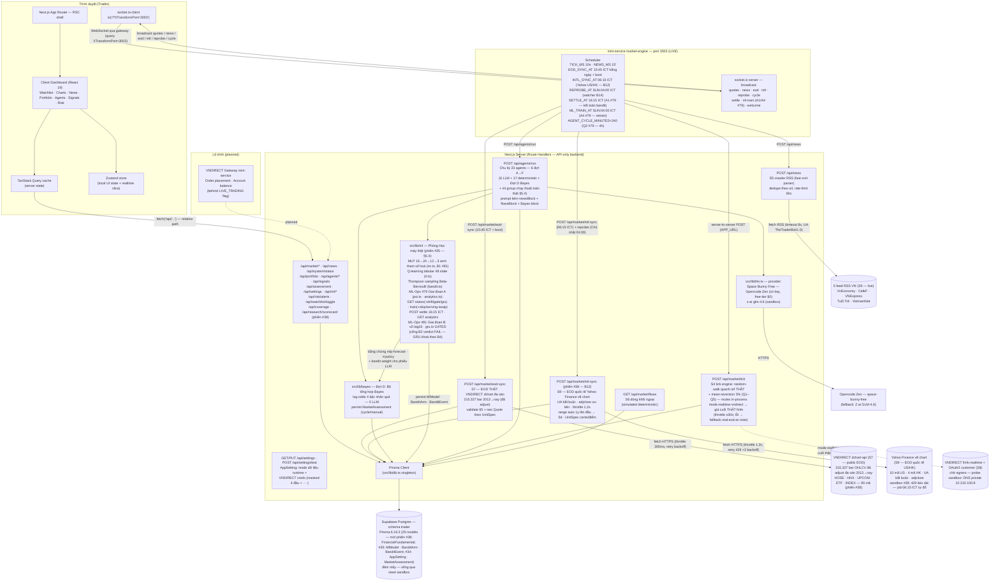
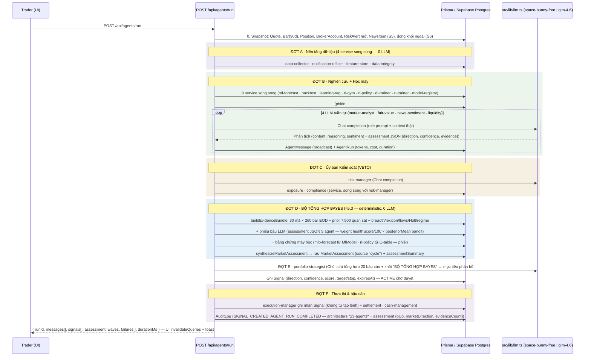

# The Trader — Technical Blueprint

> **Project:** The Trader — Hệ thống giao dịch đa agent (Multi-Agent Trading System) cho VNDIRECT
> **Document:** `docs/TECHNICAL_BLUEPRINT.md` · **Version:** 1.0.0 · **Updated:** 2026-10-07
> **Cross-refs:** [DB_SCHEMA.md](./DB_SCHEMA.md) (data dictionary) · [DATA_SOURCES.md](./DATA_SOURCES.md) (nguồn dữ liệu & mapping) · [MARKET_EXPANSION_BLUEPRINT.md](./MARKET_EXPANSION_BLUEPRINT.md) (phiên #37–#38 — mở rộng độ phủ thị trường)

---

## 1. System Overview

The Trader là một **trading workspace một trang** (single-page dashboard): trader quan sát **bảng giá đa sàn** (90 instrument active — phiên #38) realtime trên nền **lịch sử giá EOD THẬT** (215.327 bar VN đa sàn 2013→nay từ VNDIRECT dchart — [DATA_SOURCES.md §3.3](./DATA_SOURCES.md); quốc tế US/HK chờ Yahoo hồi 429 — §4 API), đọc tin tức RSS thật, theo dõi danh mục VNDIRECT mô phỏng (đã rebase theo giá thật), và điều phối một **đội 23 AI agent chia 5 nhóm** (Nghiên cứu · Kiểm soát VETO · Điều hành · Nền tảng dữ liệu · Học máy — §5.1) phân tích — tổng hợp bằng **Bộ tổng hợp Bayes nhân quả (Đợt D — §5.3, phiên #34; phiên #38 thêm segment đa thị trường + cổng đồng thuận 80%)**, với **Phòng Học máy vận hành 3 thuật toán học thật (§5.4 — phiên #35: MLP · Q-learning · Thompson sampling)** — ra tín hiệu — thực thi lệnh giấy (paper trading). Triết lý thiết kế:

1. **Paper-trading first** — toàn bộ luồng lệnh chạy nội bộ, không chạm tiền thật; live trading VNDIRECT chỉ bật sau feature flag (§9) — hiện đã có scaffold flag + cổng kiểm tra (S3, gateway thật còn pending).
2. **Mọi phân tích AI đều có audit trail** — mỗi lần chạy agent ghi `AgentRun` (token, chi phí, thời lượng) và mọi kết luận broadcast ghi `AgentMessage` (xem [DB_SCHEMA.md §6.6–6.9](./DB_SCHEMA.md)).
3. **Backend-only LLM qua lớp provider duy nhất** — `src/lib/llm.ts` chọn provider theo env (`LLM_PROVIDER=auto`): có `OPENCODE_ZEN_API_KEY` → **Opencode Zen** `space-bunny-free` (**Space Bunny Free** — free-tier $0, OpenAI-compatible REST, chạy được cả ngoài sandbox — môi trường local của trader; đây là backbone **mặc định cho toàn đội 23 agent**); không key → `z-ai-web-dev-sdk` GLM-4.6 (gateway nội bộ sandbox Z.ai). Model họ space-bunny là model reasoning nên mặc định gửi `reasoning_effort: low` (đo thực tế ~3.7s/call thay vì ~19s). Client không bao giờ thấy API key.
4. **Financial-grade conventions** — tiền VND integer, phí 0.15%, thuế TNCN 0.1% khi bán, dải trần/sàn ±7% HOSE ([DB_SCHEMA.md §8](./DB_SCHEMA.md)).
5. **Minh bạch nguồn dữ liệu** — mọi nguồn được gắn nhãn `live`/`real`/`simulated`/`fallback`/`paper` trong `DataSourceStatus` và hiển thị trên footer (nguồn `eod-history` mode `real` — dot xanh "EOD thật"); dữ liệu mô phỏng không bao giờ giả danh "live" (stale marking — [DATA_SOURCES.md §6](./DATA_SOURCES.md)).
6. **Realtime-first (tuỳ chọn)** — mini-service `market-engine` broadcast tick bảng giá, tin tức mới, kết quả EOD sync và kết quả chu kỳ agent qua WebSocket (§6); TanStack Query vẫn là cache layer duy nhất.
7. **Dữ liệu thật trước tiên (phiên #33)** — bar EOD THẬT VNDIRECT dchart (90.785 bar 2013→nay) làm nền cho mọi chỉ báo/prompt/backtest; những gì chưa có nguồn thật (intraday tick, dòng khối ngoại) được **mô phỏng quanh mức thật + gắn nhãn `simulated` minh bạch** — không bao giờ giả danh "live"; ngoài phiên bảng giá neo ở close thật (mode `real`).
8. **Tổng hợp định lượng deterministic (phiên #34)** — kết luận của đội agent không dừng ở văn bản LLM: **Bộ tổng hợp Bayes** (Đợt D của chu kỳ — §5.3) chạy log-odds naive Bayes 4 bậc nhân quả trên dữ liệu thật trong DB + assessment JSON có cấu trúc của 5 agent LLM — **0 LLM, $0**, kèm sensitivity (drivers) · disagreement · narrative tiếng Việt; VETO Ủy ban Kiểm soát vẫn là ràng buộc cứng.
9. **Học máy thật, tự huấn luyện (phiên #35)** — Phòng Học máy (7 agent nhóm `ml`) chạy **3 thuật toán thuần TypeScript, 0 dependency AI framework** (MLP backprop+Adam · Q-learning tabular · Thompson sampling Beta-Bernoulli — §5.4) huấn luyện trên bar EOD thật, kết quả persist `MlModel`/`BanditArm`/`BanditEvent` và chảy vào Bộ tổng hợp Bayes làm bằng chứng; quyết định **không dùng LlamaIndex/LangChain** (§9.1).
10. **Đa sàn · phân đoạn · cổng đồng thuận (phiên #38 — MARKET_EXPANSION_BLUEPRINT v1.1)** — universe mở rộng từ 30 mã HOSE-STOCK lên **90 instrument active**: HOSE-STOCK 30 · HNX-STOCK 20 · UPCOM-STOCK 13 · HOSE-ETF 5 · INDEX 8 (VNINDEX/VN30/VNMID/VNSML/VNALL/HNX/HNX30/UPCOM) · US 10 (8 cổ phiếu + ^GSPC · ^IXIC) · HK 4 (3 cổ phiếu + ^HSI) — **215.327 bar EOD thật VN đa sàn** (backfill dchart 98s; US/HK tạm 0 bar vì Yahoo 429 kéo dài trong phiên — job market-engine **06:15 ICT** tự đổ khi nguồn hồi, range auto `1y` lần đầu → `5d`). Đơn giá chuẩn hoá theo **bảng tra UnitSpec** (`src/lib/eod-sync.ts`: STOCK/ETF VN nghìn VND ×1000 bội 100 · INDEX điểm ×100 không trần/sàn — VNINDEX 1.753,39 · US/HK cents ×100 · BOND %×100). Bộ tổng hợp Bayes chạy **5 segment VN + composite** (trọng số ADTV thật + INDEX 0,05/index tái chuẩn hoá) + segment **INTERNATIONAL** (^GSPC · ^HSI — tham khảo, tự xuất hiện khi có bar); **ml-forecast thành cử tri thứ 6** (ensemble MLP 0,7 + linreg 0,3, deadband 0,05 → FLAT) và **cổng đồng thuận 80%** (6 cử tri, w=clamp(health/100×posteriorMean, 0,3, 1) — snapshot `Signal.consensusGate/consensusRatio` lúc sinh tín hiệu; `consensus.enforce` mặc định **FALSE = shadow-mode**, tự bật sau đủ 10 chu kỳ shadow — hiện 3/10) chặn convert tại `signal-execution.ts` khi bật. Chi tiết 15 bước B1–B15: [MARKET_EXPANSION_BLUEPRINT.md](./MARKET_EXPANSION_BLUEPRINT.md).

### Tech Stack (thực tế trong `package.json` / `bun.lock`)

| Layer | Công nghệ | Phiên bản |
|---|---|---|
| Framework | Next.js (App Router, RSC) | 16.3.8 |
| UI runtime | React / React DOM | 19.2.8 |
| Ngôn ngữ | TypeScript | 5.9.3 |
| Styling | Tailwind CSS + `tw-animate-css` | 4.3.3 |
| Components | shadcn/ui (style **new-york**, theme **neutral**, primitives Radix) + `lucide-react` icons | — |
| ORM / DB | Prisma + `@prisma/client` → **Supabase Postgres** (schema `trader`, Supavisor session pooler `:5432` qua `DATABASE_URL`) — kho dữ liệu chính bền vững qua reset sandbox | 6.19.3 |
| Server state | TanStack Query | 5.104.1 |
| Local state | Zustand | 5.0.15 |
| Theming | `next-themes` (dark default) | 0.4.6 |
| Charts | Recharts | 3.10.1 |
| Toasts | Sonner | 2.0.8 |
| Date utils | date-fns | 4.4.0 |
| AI | `src/lib/llm.ts` — provider abstraction: **Opencode Zen** `space-bunny-free` (Space Bunny Free — free-tier $0, key `OPENCODE_ZEN_API_KEY`, `reasoning_effort: low` ≈ 3.7s/call) hoặc `z-ai-web-dev-sdk` GLM-4.6 (sandbox) — backend-only, mặc định cho 6 agent LLM của đội 23 | 0.0.18 |
| Quant & Bayes | `src/lib/quant` (OLS linreg · percentile NIST · entropy · Holt double exponential + CI80 · lexicon NLP tiếng Việt ~75 thuật ngữ · regime) + `src/lib/bayes` (log-odds 4 bậc nhân quả — §5.3) — thuần TypeScript, deterministic 0 LLM | — |
| ML & RL | `src/lib/ml` — **thuần TypeScript, 0 deps AI framework mới (phiên #35 + B #81)**: `features.ts` (16 đặc trưng v2-lag16/mẫu — B1) · `nn.ts` (MLP arch tham số hoá 16→24→12→3, backprop tay + Adam) · `gru.ts` (GRU-24 BPTT tay — B3 GATED, chỉ train khi cổng B2 PASS) · `rl.ts` (Q-learning tabular) · `bandit.ts` (Thompson sampling Beta-Bernoulli) · `psi.ts` (drift PSI) · `analytics.ts` (Wilson/Brier/calibration) — §5.4 | — |
| Realtime client | `socket.io-client` (nối mini-service market-engine, §6) | 4.8.4 |
| RSS parser | `fast-xml-parser` (crawler tin tức S5) | 5.11.2 |
| Runtime | Bun | 1.3.14 |

---

## 2. Architecture



**Luồng dữ liệu:** Supabase Postgres (schema `trader`) → Route Handlers (JSON, `BigInt` → `Number`) → TanStack Query cache → React components; ngoài luồng pull này còn **luồng push** từ mini-service `market-engine` qua WebSocket ghi thẳng vào cache (§6). Mutations hiện tại: `POST /api/agents/run` (kích hoạt **chu kỳ 23 agents chạy 6 đợt A→F** — phiên #34 thêm **Đợt D Bộ tổng hợp Bayes nhân quả** giữa Control và Chủ tịch: 6 lượt LLM + 17 agent dịch vụ deterministic + 1 engine Bayes 0 LLM, sinh `AgentMessage`/`Signal` giấy/`MarketAssessment`), `POST /api/market/tick` (tick giá S4 quanh ref thật + khớp lệnh giấy + EOD rollover; **mode runtime `realtime-vndirect`** → giá cuối thật finfo — §6.5), `POST /api/market/eod-sync` (đồng bộ **bar EOD THẬT VNDIRECT dchart** + neo Quote), `POST /api/news` (crawler RSS S5), `POST /api/assessment/synthesize` (tổng hợp lại nhận định Bayes — 0 LLM, cooldown 10s), **`POST /api/ml/train` (phiên #35 — huấn luyện lại MLP + Q-learning trên bar EOD thật; settle bandit trước train; cooldown 10s → 429 + Retry-After)**, `PUT /api/settings` + `POST /api/settings/test` (module Cài đặt — cấu hình VNDIRECT + mode dữ liệu runtime), `POST /api/signals/[id]/convert`, `POST /api/watchlist/toggle`, `POST /api/orders/[id]/cancel` (hủy lệnh chờ khớp); **phiên #38 thêm `POST /api/market/intl-sync` (đồng bộ EOD quốc tế Yahoo — range auto) và `POST /api/market/reprobe` (watcher probe ô ⚪/🟡 — idempotent)**. Không dùng Server Actions — mọi đọc/ghi server đều qua Route Handler để tập trung validation + audit (§7).

---

## 3. Frontend Architecture

**Một trang duy nhất tại `/`** (App Router: RSC shell render layout, phần tương tác là client components). Từ phiên #34 trang này là **App Shell với 7 workspace** chuyển bằng Zustand (`activeWorkspace: "overview" | "market" | "portfolio" | "signals" | "agents" | "synthesis" | "settings"`, deep-link `?ws=` đọc 1 lần khi mount + validate) — KHÔNG thêm route; realtime socket sống ở cấp trang nên đổi workspace không đứt kết nối. Nav dạng `role="tablist"` 7 tab nằm dưới thanh logo trong Header (mobile: hàng cuộn ngang `overflow-x-auto` + snap-x + ẩn scrollbar, mọi tab flex-none ≥44px; phím mũi tên modulo 7; badge chấm live khi engine nối).

**Workspace "Tổng quan" (viết lại gọn từ phiên #34 — chỉ còn 4 khối):**

| Section | Nội dung | Nguồn dữ liệu |
|---|---|---|
| **Market summary** | VN-Index proxy (trung bình biến động VN30), số mã tăng/giảm/đứng giá, thanh khoản, top movers + **Market pulse bar**: dòng khối ngoại ròng (S6) · tin tức mới nhất (S5) · tuổi tick realtime | `GET /api/market/quotes` (trường `summary` nhúng), `GET /api/market/flows`, `GET /api/news`, Zustand `lastTickAt` |
| **AssessmentBrief** | Card nhận định **Bộ tổng hợp Bayes** rút gọn (§5.3): badge hướng (TĂNG/GIẢM/ĐI NGANG) + stacked bar 3 xác suất + 3 stat (độ tin cậy · bất đồng · số bằng chứng) + caption nguồn + link "Xem chi tiết" → workspace Tổng hợp; empty state "chưa chạy" + nút chạy chu kỳ; error state + Thử lại | `GET /api/assessment` |
| **Signals (compact)** | Feed tín hiệu gọn (`compact` + `limit=5`: badge + mã + điểm + rationale truncate + "Đã chuyển lệnh"), footer "Xem tất cả (N) →" sang workspace Tín hiệu | `GET /api/signals` |
| **AgentSystemBrief** | 23 agents 5 nhóm, mỗi nhóm 1 hàng (badge số lượng + chấm tổng ERROR/RUNNING/IDLE) + hàng cuối nút "Chạy chu kỳ 23 agents" (`useRunAgents`) + link "Xem đội agent →" + model LLM đang chạy | `GET /api/agents` |

Header (đồng hồ phiên ATO/liên tục/ATC · badge Live · chip tài khoản mask · chip Sức mua ước tính G3 §5.4 · nút Chạy agent) và sticky footer (chips trạng thái nguồn · chip chi phí AI G3 §5.5) là chrome dùng chung ở cấp trang. **6 workspace còn lại (phiên #34):**

- **Thị trường** — MarketSummary (khoá HOSE-STOCK tránh trộn đơn vị — phiên #38) + QuotesTable (**phiên #38: group theo sàn HOSE→HNX→UPCOM→US→HK + nhóm Chỉ số, định dạng giá theo UnitSpec** — nghìn ₫ · điểm · cents; watchlist ⇄ danh mục theo dõi, tìm kiếm, cột sao, toggle cột mở rộng G3 §5.2 với dấu ⌃/⌄ trần/sàn) + PriceChart (**Nến Nhật** custom Bar shape wick+thân + volume histogram màu phiên + **panel RSI14 Wilder** ~96px guideline 30/70 + toggle Nến/Đường + SMA20 + range 30/60/90 + symbol picker) + NewsCard (12 tin + badge chế độ nguồn + nút Nạp tin) — header nhỏ "Bảng giá đa sàn — dữ liệu EOD thật (dchart · Yahoo)".
- **Danh mục** — PortfolioSection (tabs **Vị thế** P&L runtime + **cột % tỷ trọng** G3 §5.3 · **Lệnh** nút Hủy · **Giao dịch** + donut phân bổ ngành ≥ md + ô ghép Biến động ngày / Realized P&L).
- **Tín hiệu** — "vận hành tín hiệu": SignalsFeed đầy đủ (bảng Signal direction/confidence/score/target/SL/TP/rationale/expiresAt + trạng thái ACTIVE/ACTED/REJECTED/EXPIRED + nút Chuyển lệnh) + cột phải RiskAlerts (thẻ cảnh báo theo severity) + **AgentsPanel compact** (feed broadcast + nút ✅ Phê duyệt/⛔ Từ chối tín hiệu ACTIVE + AgentTask list; lưới 23 thẻ agent rút thành nút "Xem hồ sơ chi tiết 23 agents" → tab Đội Agent).
- **Đội Agent** — giữ nguyên cấu trúc Giai đoạn 3 (bảng dưới) + **phiên #38 thêm 2 card "Bảng điểm Hội đồng Nghiên cứu" + "Ma trận độ phủ thị trường" dưới section nhóm research (B8/B14 — xem dưới)**.
- **Tổng hợp (Bộ tổng hợp Bayes — §5.3)** — header card nhận định (badge hướng lớn TĂNG/GIẢM/ĐI NGANG + stacked probability bar 3 màu pUp/pFlat/pDown + 3 stat Độ tin cậy · Bất đồng · Số bằng chứng + caption nguồn "chu kỳ 23 agents" / "Tổng hợp lại thủ công") + narrative tiếng Việt italic + **banner VETO** destructive khi Ủy ban Kiểm soát PHỦ QUYẾT (kèm reason) + **phiên #38: card "Đa thị trường — posterior phân đoạn"** (bảng 5 segment VN + composite Σ trọng số + INTERNATIONAL tham khảo) và **card "Cổng đồng thuận 80%"** (thanh tally 3 cụm trọng số + ngưỡng 80% + 6 phiếu kèm badge ML cho ml-forecast + trạng thái Shadow-mode/Enforcement) + 3 card bậc nhân quả (Bậc 0 tiên nghiệm · Bậc 1 thị trường: breadth + regime + newsSentiment + netForeignFlow + forecast5d kèm CI · Bậc 2 nhóm ngành) + bảng Bậc 3 cổ phiếu (Mã · P(tăng)/P(giảm) · stance BUY/SELL/HOLD · z · RSI14 amber khi <30/>70 · momentum · dự báo 5p · 2 drivers) + bảng bằng chứng (agent · gen1 · cấp thị trường/cổ phiếu · hướng · trọng số · LR × · Δlog-odds signed màu + mini bar) + lịch sử (LineChart mini pUp% domain 0–100 + list 5 bản mới nhất); 2 nút header: **"Tổng hợp lại ngay"** (POST synthesize — 0 LLM, cooldown 10s) + **"Chạy chu kỳ đầy đủ"**; cuối workspace thêm **card "Học máy & Học tăng cường"** (phiên #35 — §5.4, query `['ml-status']` polling 30s độc lập với assessment): 3 khối MLP/Q-learning/Bandit + nút **Huấn luyện mô hình** (`POST /api/ml/train` — toast valAcc thật; 429 → "thử lại sau ~N giây") + 404 state "Đang chờ backend học máy" khi backend chưa có.
- **Cài đặt** — 3 card: (1) **Kết nối VNDIRECT** — 4 input (consumer key/secret/access token có nút mắt hiện/ẩn + số tài khoản; placeholder "Đã lưu: <masked>") + nút Kiểm tra kết nối (probe thật — inline authOk/finfoOk/latency/sampleQuote) + Lưu cấu hình + Xoá cấu hình + dòng "Lần kiểm tra gần nhất" từ server; (2) **Nguồn dữ liệu thị trường** — radiogroup 3 mode theo WAI-ARIA (`real-eod` / `realtime-vndirect` / `simulated`; badge "Mặc định" · "Chưa kết nối" · "Fallback: EOD thật") + nút Áp dụng + footer strictSession (Phiên HOSE 09:15–15:00) + đồng bộ EOD 15:45 ICT + realtimeOk/lastRealtimeAt; (3) **Mô hình AI & đội agent** (read-only: model label + badge "Miễn phí" + "23 agents · 5 nhóm · chu kỳ 6 đợt" + 3 risk limit + thời điểm assessment cuối).

**Workspace "Đội Agent" (G3 §4.7):** header tổng quan đội (số agent · chi phí AI lũy kế · nút **Chạy chu kỳ đầy đủ (23 agents)**) + layout 2 cột xl: trái = **23 roster card chia 5 nhóm** theo `group` (research · control · executive · platform · ml — header nhóm sticky + cuộn dọc riêng ở desktop; nhóm control mang **badge VETO** amber; icon vai riêng từng role, health bar, status dot, stats mini, nút ▶ **Chạy riêng** — disabled kèm đếm ngược 429) · phải = **panel chi tiết** 5 tab (Hồ sơ / Hoạt động — bảng AgentRun + sparkline chi phí 7 ngày / Nhiệm vụ / Phát thanh + tín hiệu đang mở kèm nút duyệt-từ chối / **Chat** — thread USER↔AGENT, cảnh báo "~$0.006/tin", rate-limit 60s/agent hiển thị đếm ngược). Execution Manager không chat/chạy lẻ (409/400 + Card giải thích). **Phiên #38 — dưới section nhóm research thêm 2 card:** **"Bảng điểm Hội đồng Nghiên cứu"** (scorecard B8 — `GET /api/research/scorecard`, 8 cột pulls/hit-rate/Brier/đóng góp posterior/streak/posterior bandit/health, pulls<5 → badge "chưa đủ dữ liệu") + **"Ma trận độ phủ thị trường"** (coverage B14 — `GET /api/coverage`, lưới 15 ô 3×5 + hàng quốc tế + dòng finfo, 3 màu real/empty/pending-source, tooltip chi tiết từng ô).

### State management

- **TanStack Query — server state:** query keys chuẩn `[resource, params]` (VD `['quotes']`, `['watchlist']`, `['bars', symbol, days]`, `['agents']`, `['news']`, `['system-status']`, `['assessment']`, `['settings']`, **`['ml-status']` (phiên #35 — polling `refetchInterval` 30s · staleTime 15s · không retry khi 404 "chờ backend")**); `staleTime` phân tầng: quote/watchlist 30s, agent messages/news/assessment/settings 30s, portfolio/orders/signals/risk/system-status 30–60s, bars 5 phút; sau `POST /api/agents/run` thành công thì `invalidateQueries` toàn bộ key `['agents']`/`['agent-messages']`/`['signals']`/`['orders']`/`['portfolio']`/`['quotes']`/`['risk-alerts']`/`['assessment']` (chu kỳ giờ chạy Đợt D Bayes giữa Control & Chủ tịch) để phản ánh kết quả chu kỳ mới (gộp trong hook dùng chung `useRunAgents`); sau `POST /api/ml/train` thành công thì `invalidateQueries(['ml-status'])` (hook `useMlStatus`/`useTrainMl` — phiên #35).
- **Zustand — local UI state** (`src/lib/store.ts`): `selectedSymbol`, `chartDays`, `portfolioTab`, `watchlistOnly`, **`activeWorkspace` (G3 B1 — mở rộng 7 giá trị từ phiên #34)**, **`chartMode` (G3 B3)**, **`quotesExpanded` (G3 B3)** + **slice realtime**: `realtimeConnected` (đèn Live/badge Realtime) và `lastTickAt` (tuổi tick cho Market pulse bar) — cập nhật từ hook `useRealtimeMarket` (§6). Không chứa dữ liệu server (tránh dual source of truth).

### Theming & design tokens

- `next-themes` với **dark mặc định** (`class` strategy), bảng màu **neutral oklch** của shadcn/ui new-york.
- **Màu semantic lên/xuống theo quy ước thị trường Việt Nam:** xanh = tăng, đỏ = giảm (ngược với quy ước Mỹ) — token `up`/`down` dùng xuyên suốt watchlist, chart, signals, PnL.
- **`tabular-nums`** cho mọi cột số — chữ số thẳng cột, bắt buộc với bảng tài chính; dấu phân cách hàng nghìn kiểu `vi-VN`, đơn vị VND rút gọn (tr/Tỷ/Tr).
- Skeleton loading (shadcn `Skeleton`) cho mọi section khi fetch lần đầu; empty states cho watchlist/signals trống.

---

## 4. API Surface

Tất cả route là **Route Handlers** trả JSON; lỗi trả `{ "error": string }` + status phù hợp (400/404/500). `BigInt` serialize thành `Number` (an toàn < 2^53). Client gọi bằng **relative path** (`fetch('/api/...')`).

| Method | Route | Mục đích | Response (tóm tắt) |
|---|---|---|---|
| GET | `/api/market/quotes` | Toàn bộ VN30 + quote mới nhất (volume desc) **+ summary** (VN-Index proxy, bề rộng, thanh khoản, top gainer/loser) **+ meta nguồn** (`mode`/`asOf` — S4 stale marking) | `{ quotes: QuoteRow[], summary, meta }` |
| POST | `/api/market/tick` | **Tick bảng giá S4** (engine mô phỏng quanh ref THẬT): random-walk + mean-reversion 3% trên quote mới nhất từng mã, tuân thủ Q1 (bội 100) · Q2 (dải ±7%) · Q3 · Q5; **EOD rollover** khi sang ngày ICT mới (REAL_EOD_MODE mặc định — **KHÔNG ghi bar synthetic**, bar EOD thuộc về nguồn thật S7; refPrice/dải/volume mới — ngân sách ngày 0,3–9,2tr cp); **khớp lệnh giấy** PENDING/PARTIALLY_FILLED khi giá vượt điều kiện (BUY `last ≤ giá đặt` · SELL `last ≥ giá đặt`) — cập nhật Trade/Position/tiền mặt/equity + audit `ORDER_FILLED`; lệnh SELL vượt điều kiện nhưng không đủ vị thế → **tự REJECTED 1 lần** + audit `ORDER_REJECTED` (không retry); **mutex in-process** (AUD-CODE #18 — mọi POST tuần tự, chống lost-update); `MARKET_STRICT_SESSION=true` (mặc định) thì chỉ chạy trong phiên (ngoài phiên trả `skipped: true` + đánh dấu nguồn mode `real` — bảng giá neo close thật); **phiên #34 — nhánh realtime:** mode runtime `realtime-vndirect` (AppSetting ghi đè env — §6.5) + trong phiên + đã cấu hình → fetch **giá cuối THẬT finfo** (`src/lib/vndirect.ts`, throttle ≥30s kèm cache module-level — tick 10s dùng cache; giá round100 + clamp dải ±7%, change/changePct từ ref EOD thật, volume/high/low dồn phiên thật); fetch fail → `markSource` mode `fallback` + lastError + tiếp tục random-walk như cũ (không bỏ tick); ok → mode `real` + meta provider `finfo-vndirect` | payload cùng shape `GET /api/market/quotes` + `ticked`/`rolled`/`fills` |
| POST | `/api/market/eod-sync` | **Đồng bộ EOD THẬT VNDIRECT dchart (S7 — `src/lib/eod-sync.ts`)**: kéo bar EOD đã adjust cho toàn bộ instrument active (body tuỳ chọn `{ days }` — lookback mặc định 10 ngày, clamp 2–365) → validate §5 Q1–Q9 → upsert `Bar` theo `@@unique([instrumentId, date])` → **neo `Quote` vào close thật** (ref/OHLC/volume/trần/sàn thật) → đánh dấu nguồn `eod-history` mode `real`; engine gọi 15:45 ICT hằng ngày + lúc boot; mutex tự nhiên qua throttle 300ms/request | `EodSyncOutcome { ok, symbolsOk[], symbolsEmpty[], symbolsFailed[{symbol, error}], barsUpserted, barsSkipped, lastTradeDate, durationMs, days }` · 502 khi mọi mã fail |
| GET | `/api/market/flows` | **Dòng khối ngoại ròng S6**: mode `simulated` — deterministic (FNV-1a hash theo mã+ngày), scale theo thanh khoản thật (2–80 tỷ VND); tổng bán ròng < −300 tỷ → RiskAlert WARNING `FOREIGN_FLOW_OUTFLOW` (dedupe 24h) | `{ mode, asOf, totalNet, totalBuy, totalSell, topNet[], topSell[], note }` |
| GET | `/api/news?limit=12` | 12 tin RSS mới nhất (S5) + meta nguồn cho stale marking | `{ items[], meta: { total, mode, lastSuccessAt, stale, ageMinutes, providers } }` |
| POST | `/api/news` | **Chạy crawler RSS 5 nguồn ngay** (rate-limit 60s giữa 2 lần nạp, audit `NEWS_INGESTED`) — nạp được thì `mode=live`, nguồn chết → `fallback` | `{ added, updated, total, mode, feeds[] }` · 429 nếu dồn lịch |
| GET | `/api/system/status` | Trạng thái toàn hệ thống cho footer/monitoring: gọi `escalateStaleSources()` (DATA_SOURCE_STALE WARNING khi stale >4h, dedupe 24h) trước khi đọc; **phiên #34: khối `market` thêm `effectiveMode` + `realtimeOk`** (mode runtime AppSetting) | `{ sources[], trading, market (effectiveMode, realtimeOk), counts, escalatedAlerts, serverTime }` |
| GET | `/api/settings` | **Module Cài đặt (phiên #34)**: cấu hình VNDIRECT (**secret mask** — 4 ký tự đầu + "····"; `configured`) + `marketData` (mode · effectiveMode · strictSession · eodSyncAt · realtimeOk · lastRealtimeAt) + `llm` (model runtime) + `risk` (3 limit) + `bayes` (enabled + lastAssessmentAt) | `{ vndirect, marketData, llm, risk, bayes, updatedAt }` |
| PUT | `/api/settings` | Lưu cấu hình — secret: **bỏ trống = giữ nguyên**, chuỗi `""` = xoá, giá trị chứa marker masked bị bỏ qua (chống echo UI làm hỏng secret đã lưu); mode validate ∈ {real-eod, realtime-vndirect, simulated} — sai → 400 tiếng Việt; realtime-vndirect chưa cấu hình vẫn lưu nhưng `effectiveMode` = real-eod | `SettingsResponse` (mới) · 400 |
| POST | `/api/settings/test` | **Probe kết nối THẬT**: OAuth2 `client_credentials` (auth.vndirect.com.vn) + finfo `/v4/lastprice`; test bằng creds đã lưu → ghi `lastTest` vào AppSetting; creds mới trong body → KHÔNG lưu, KHÔNG đè lastTest; `maxDuration` 30s; lỗi mạng → message tiếng Việt + gợi ý whitelist egress | `{ ok, authTried, authOk, finfoOk, latencyMs, sampleQuote, message }` |
| POST | `/api/watchlist/toggle` | Thêm/gỡ mã khỏi watchlist mặc định (body `{ symbol }`) + audit `WATCHLIST_ADDED`/`WATCHLIST_REMOVED` | `{ symbol, inWatchlist, count }` · 404 nếu mã/watchlist không có |
| GET | `/api/market/watchlist` | Watchlist mặc định + quote mới nhất mỗi mã (cùng dạng QuoteRow) | `{ watchlist: { name, count, quotes[] } }` |
| GET | `/api/instruments/bars?symbol=VCB&days=90` | Chuỗi OHLCV + SMA20 cho price chart (cap 90 ngày) | `{ symbol, name, last, change, changePct, bars[] }` |
| GET | `/api/market/intraday?symbol=VCB&days=5` | **#83 — chuỗi bar 5-phút (bảng `IntradayBar`)**: tick 10s trong phiên gom thành bucket 5-phút (floor UTC — biên trùng ICT); query `days` (1-30, mặc định 5) hoặc `day=YYYY-MM-DD` lấy đúng 1 phiên; mỗi bar kèm `source` (simulated/realtime-finfo) + `tickCount` (độ phủ — bucket kín ≥ 25) — không bịa dữ liệu, bucket thiếu là thiếu; meta `coverage` tổng hợp bucket kín/đứt | `{ symbol, name, market, days, count, tradingDays, lastBarAt, coverage, bars[] }` · 400 thiếu symbol · 404 mã lạ |
| GET | `/api/portfolio` | Sổ tài khoản demo (**accountNumber đã mask**) + positions P&L runtime + totals | `{ account, positions[], totals }` |
| GET | `/api/orders` | 20 lệnh + 20 bút toán gần nhất (fee/tax dạng Number) | `{ orders[], trades[] }` |
| POST | `/api/orders/[id]/cancel` | **Hủy lệnh đang chờ khớp** (chỉ PENDING/PARTIALLY_FILLED — phần chưa khớp; lệnh đã kết thúc → 409; không có → 404) + audit `ORDER_CANCELLED`; chạy đua an toàn với fill engine trong tick (claim có điều kiện) | `{ order }` · 404/409 |
| GET | `/api/agents` | Trạng thái **23 agent** (config parse, pendingTaskCount, lastRun, **`group`/`groupLabel` — 5 nhóm research/control/executive/platform/ml**) + **stats mỗi agent (G3 §4.2**: runCount, successRate, totalTokensIn/Out, totalCostUsd, lastError, chatCount)** + **totals chi phí AI toàn đội** + 12 nhiệm vụ | `{ agents[] (kèm stats + group/groupLabel), tasks[], totals, llm }` |
| POST | `/api/agents/run` | **Chu kỳ phân tích đầy đủ 23 agents — 6 đợt A→F (phiên #34)** (A nền tảng 4 service song song → B nghiên cứu+học máy 8 service + 4 LLM tuần tự → C kiểm soát risk LLM + 2 service → **D Bộ tổng hợp Bayes nhân quả — §5.3, deterministic 0 LLM, chạy giữa Control và Chủ tịch** → E Chủ tịch tổng hợp 20 báo cáo + khối Bayes → F thực thi; 6 lượt LLM + 17 deterministic; xem §5.2; prompt kèm `newsBlock` + `flowsBlock`; **G3: tín hiệu BUY/SELL sinh ra ACTIVE chờ trader phê duyệt — không tự tạo lệnh**, audit `SIGNAL_CREATED`; cooldown chu kỳ 60s) | `{ runId, messages[], signals[], order: null, failures[], durationMs, assessment (assessmentSummary — phiên #34), waves { architecture, agentsRan, platform, researchAndMl, control, executive } }` |
| GET | `/api/assessment` | **Bộ tổng hợp Bayes (phiên #34 — §5.3)**: bản nhận định mới nhất (`source` = `cycle` \| `manual`, kèm `cycleRunId` gắn run Chủ tịch) + lịch sử 30 bản; chưa có → 200 với `assessment: null` | `{ assessment: MarketAssessmentView \| null, history[] }` |
| POST | `/api/assessment/synthesize` | **Tổng hợp lại ngay — 0 LLM, $0**: buildEvidenceBundle từ DB thật (30 mã × 260 bar EOD + prior 7.500 quan sát) + phiếu LLM gần nhất → synthesize → persist `source="manual"` (42 bằng chứng quant-only — đo ~1,5s); **cooldown 10s** (gọi dồn → 429 + header `Retry-After`); `maxDuration` 60 | `{ assessment: MarketAssessmentView }` · 429 |
| GET | `/api/ml/status` | **Phòng Học máy (phiên #35 — §5.4)**: trạng thái 3 mô hình học thật — `dlMlp` (version · status serving/archived · trainedAt · **`featureSet` B1 #81: v1-lag10/v2-lag16** · metrics: epochs/samples/trainAcc/valAcc/valLoss/topSymbols) + `rlQ` (version · episodes · epsilonFinal · avgReward50 · stance · exposure · qMax) + `bandit` (6 arms α/β/pulls/wins/posteriorMean + `pendingSettles` + `lastSettleAt`) + **`drift` (A3 #79 — PSI 30 phiên gần nhất vs histogram lúc train: ngưỡng 0,1/0,25 · `retrainRecommended`; bản serving chưa có featureHist → `available:false` trung thực)** + **`gate` (B2 #81 — verdict cổng bằng chứng: ΔBrier CI · số đặc trưng mới có ý nghĩa · `passedVia` · `swappedServing`; chưa đo → `available:false` + reason)** + **`gru` (B3 #81 — trạng thái giọng thứ ba: null khi chưa từng train)** + **`rag` (#83 — corpus 500+200 docs · 30 ngày RetrievalLog · tỉ lệ usedInPrompt — dữ liệu cổng L3)** + **`intraday` (#83 — số bar/mã/phiên bar 5-phút + nguồn — tiến độ cổng "Lớp chuỗi đầy đủ")**; TTL cache 15s; model chưa train → trường `null` (UI hiện empty-note) | `{ dlMlp, rlQ, bandit, pendingSettles, drift, gate, gru, rag, intraday }` |
| POST | `/api/ml/train` | **Huấn luyện lại MLP + Q-learning trên bar EOD thật** (body `{target: "all"\|"dl-mlp"\|"rl-q"\|"dl-gru", force}` — mặc định `all`+`force:true` cho nút bấm): settle bandit pending trước train → train MLP (`buildTrainingSet(20)` top-20 thanh khoản, **v2-lag16 16 đặc trưng B1 #81**) + Q-learning (300 episodes) **tuần tự, try/catch độc lập** → versioning trong MỘT $transaction; **A4 #79**: `force:false` (engine CN 04:00) kèm skip-guard windowHash so bản serving + bản mới nhất **VÀ featureSet** (không có bar mới → skip $0) · serving-swap guard (valAcc bản mới < bản serving **HOẶC khác featureSet khi cổng B2 chưa PASS** → lưu archived, giữ bản cũ, trả `promoted:false` + **`promotionReason` F-B811-01: "valacc" \| "featureset-gate"**) · meta lưu `featureHist` + `featureSet`; **B3 #81**: target `dl-gru` chỉ chạy khi AppSetting `ml-gate` verdict PASS — cổng chưa mở/FAIL → **400 kèm lý do trung thực**; **cooldown 60s + mutex in-flight → 429 + header `Retry-After`** (F-612R-06/#61); đo thật ~13s (all) | `{ ok, trained[], dlMlp, rlQ, dlGru?, promoted?, promotionReason?, servingValAcc?, newValAcc?, durationMs }` · 400/429 |
| POST | `/api/ml/settle` | **A1 #79 — kết toán bandit theo lịch** (engine gọi 16:15 ICT hằng ngày sau eod-sync, chỉ ngày giao dịch — không T7/CN): wrapper mỏng `settlePendingRewards()` thuần thuật toán 0 LLM ~1-2s · idempotent qua settledKeys · mutex in-process · **AuditLog `ML_SETTLE`** mọi lần chạy (kể cả 0/0 — truy vết "đã chạy đúng hạn") | `{ ok, settled, votes, details[], durationMs }` |
| GET | `/api/ml/analytics` | **A2 #79 — kiểm định thống kê vòng học bandit** (thuần truy vấn 0 ghi DB · TTL cache 15s): 6 arm Wilson 95% CI + posterior (α+1)/(α+β+2) · Brier Murphy decomposition (reliability−resolution+uncertainty, nhị phân hoá reward ≥ 0,5) + calibration 5 bucket · posterior trajectory theo timeline settle · bảng agent × regime (PIT tại phiên cast — cùng nguồn classifyRegime của Bayes); chưa có settle → payload rỗng trung thực (metric null, n<30 → insufficient) | `{ ok, arms[], brier{overall, decomposition, arms}, calibration[], trajectory[], regimeTable, totalSettled }` |
| GET | `/api/agents/[id]` | **G3 §4.2 — hồ sơ chi tiết agent**: config parsed + stats + 20 runs + 12 tasks + **thread chat 1-1 (asc)** + 20 tin broadcast + signals ACTIVE của agent | `{ agent, runs[], tasks[], chat[], broadcastFeed[], signals[] }` · 404 nếu id rác |
| POST | `/api/agents/[id]/run` | **G3 §4.3 — chạy riêng 1 agent**: agent **LLM** (6 agent nhóm research/control/executive) gọi model như chu kỳ; agent **service (17)** chạy **deterministic từ DB qua `src/lib/agent-service-runs.ts` — 0 chi phí LLM**; rate-limit 60s/agent dựa trên AgentRun cuối — 429 kèm `retryAfterSeconds` + header Retry-After; execution-manager → 409; agent RUNNING → 400 | `{ agent, message, run }` · 404/400/409/429 |
| POST | `/api/agents/[id]/chat` | **G3 §4.4 — chat trực tiếp** (body `{message}` 2–500 ký tự; lưu tin USER ngay kể cả LLM lỗi; 10 tin history + bối cảnh dữ liệu compact; audit `AGENT_CHAT`; LLM lỗi → 200 reply null + error VN) | `{ userMessage, reply, run, threadLength, error? }` · 400/404/429 |
| GET | `/api/agents/messages?limit=30` | Feed tin broadcast gần nhất (kèm `direction`) | `{ messages[] }` join `fromAgent` |
| GET | `/api/signals?limit=` | Tín hiệu còn hiệu lực + gần nhất (kèm `status`/`rejectedAt`/`rejectNote` G3) | `{ signals[] }` join `Instrument` + `Agent` |
| POST | `/api/signals/[id]/convert` | Chuyển tín hiệu BUY/SELL thành lệnh PENDING (sizing budget 50tr/nửa vị thế — qua `src/lib/signal-execution.ts` chung với decision; giữ 409 nếu đã act); qua cổng S3 — `LIVE_TRADING` bật nhưng thiếu cấu hình → 503 + audit `LIVE_TRADING_BLOCKED`; đủ cấu hình mà chưa có gateway → 501 + audit `LIVE_ORDER_GATEWAY_UNAVAILABLE` | `{ order }` |
| POST | `/api/signals/[id]/decision` | **G3 §4.5 — phê duyệt / từ chối tín hiệu** (body `{action: APPROVE\|REJECT, note?}`): APPROVE → lệnh paper **sizing 5% NAV** + `status=ACTED` + audit `SIGNAL_APPROVED` (via decision) + `ORDER_CREATED`; REJECT → `status=REJECTED` + `rejectedAt`/`rejectNote` + audit `SIGNAL_REJECTED` (không tạo AgentMessage); guard 409 khi `status != ACTIVE`; SELL không vị thế → 400 | `{ signal, order? }` · 400/404/409 |
| GET | `/api/research/scorecard` | **Bảng điểm Hội đồng Nghiên cứu (phiên #38 — B8)**: thuần DB 0 LLM cho **6 cử tri** (5 LLM research + ml-forecast) — pulls/wins · hit-rate 5 phiên · Brier (trên `BanditEvent.confidence`) · đóng góp posterior \|Δlog-odds\| · streak · posteriorMean Beta(α+1,β+1) · healthScore; pulls < 5 → `enoughData=false` (UI hiển thị "chưa đủ dữ liệu" trung thực) | `{ agents: ScorecardRow[], generatedAt }` |
| POST | `/api/market/intl-sync` | **Đồng bộ EOD quốc tế US/HK từ Yahoo Finance v8 chart (phiên #38 — B12 — `src/lib/intl-eod.ts`)**: body `{range}` whitelist `5d\|1mo\|3mo\|6mo\|1y\|2y\|auto` (auto: chưa có bar → `1y` backfill lần đầu, đã có → `5d`); UA bắt buộc · throttle 1,2s · retry 429 ×3 backoff 5/15/45s · **adjclose ưu tiên** (đã adjust split/cổ tức, fallback `close`) · null-skip · circuit-breaker ≥3 mã lỗi liên tiếp → upsert `Bar` theo UnitSpec (cents ×100 · index điểm ×100, không trần/sàn) + neo Quote; **cooldown 30s** → 429 + `Retry-After`; `maxDuration` 300; market-engine gọi **06:15 ICT hằng ngày** + broadcast `intl` | `IntlSyncOutcome { ok, symbolsOk[], symbolsFailed[], barsUpserted, nullSkipped, adjcloseUsed[], range, durationMs }` · 400/429/502 |
| GET | `/api/coverage` | **Ma trận độ phủ thị trường (phiên #38 — B14)**: 15 ô 3 sàn × 5 loại + hàng quốc tế (US · HK) + hàng dữ liệu cơ bản finfo — 3 trạng thái `real` (có mã + có bar) / `empty` (0 sản phẩm niêm yết) / `pending-source` (chờ nguồn: bond · US/HK chờ Yahoo · fundamentals pending-egress) — 5 query cố định N+1-free, không bảng mới | `{ grid[15], intlRow[], fundamentalsRow, generatedAt }` |
| POST | `/api/market/reprobe` | **Watcher re-probe ô ⚪/🟡 (phiên #38 — B14)**: probe dchart **trước khi tạo** instrument cho 18 ứng viên chuẩn (FUND/ETF/UPCOM còn trống); có dữ liệu → tạo Instrument + backfill riêng mã đó; idempotent (mã đã tồn tại → `skippedExisting`); body `{candidates?}` override tập con; **cooldown 60s** → 429 + `Retry-After`; market-engine chạy **Chủ nhật 04:00 ICT** hằng tuần + broadcast `reprobe` | `{ probed, created[], skippedExisting[], empty[], failed[], barsCreated, durationMs }` · 400/429 |
| GET | `/api/risk/alerts` | Cảnh báo rủi ro | `{ alerts[] }` sort severity + `createdAt` desc |

Tham chiếu field: mỗi response khớp định nghĩa model tại [DB_SCHEMA.md §6](./DB_SCHEMA.md); nguồn gốc dữ liệu của từng field tại [DATA_SOURCES.md §3–4](./DATA_SOURCES.md).

---

## 5. Multi-Agent Design

### 5.1 Đội 23 agents — 5 nhóm (kiến trúc Gen-1 DESIGN.md §4.1)

Nguồn duy nhất: **`src/lib/agent-roster.ts`** (thuần dữ liệu, không import — dùng chung bởi `prisma/seed.ts` · `prisma/expand-agents.ts` · API routes · UI). Mỗi agent có `group` (5 nhóm) và `kind`: **`llm`** — chu kỳ gọi model qua `src/lib/llm.ts` (prompt role trong `src/lib/agent-context.ts`) hoặc **`service`** — chạy deterministic từ DB (`src/lib/agent-service-runs.ts`, 0 chi phí LLM, ~0.2–1.5s).

| Nhóm (`group`) | Label UI | Agents (code · Gen-1) | kind |
|---|---|---|---|
| `research` (5) | Hội đồng Nghiên cứu | `market-analyst` (A2) · `fair-value` (A3) · `news-sentiment` (A4) · `liquidity` (A5) · `ml-forecast` (A15) | 4 LLM + 1 service |
| `control` (3) | Ủy ban Kiểm soát · VETO | `risk-manager` (A6) · `exposure` (A7) · `compliance` (A8) | 1 LLM + 2 service |
| `executive` (4) | Ban Điều hành | `portfolio-strategist` (A1 — **Chủ tịch**) · `execution-manager` (A10) · `settlement` (A11) · `cash-management` (A12) | 1 LLM + 3 service |
| `platform` (4) | Nền tảng Dữ liệu | `data-collector` (S0) · `notification-officer` (S1) · `feature-store` (S2) · `data-integrity` (A9) | 4 service |
| `ml` (7) | Phòng Học máy | `learning-rag` (A13) · `backtest` (A14) · `rl-gym` (S3) · `rl-policy` (A16) · `dl-trainer` (A17) · `rl-trainer` (A18) · `model-registry` (A19) | 7 service |

**6 agents chạy LLM mỗi chu kỳ** (market-analyst · fair-value · news-sentiment · liquidity · risk-manager · portfolio-strategist); **17 agents còn lại chạy deterministic từ DB** — 16 hàm trong `agent-service-runs.ts` + execution-manager do chu kỳ xử lý riêng vì cần `Signal` đầu vào. `config` JSON thật của từng agent xem `src/lib/agent-roster.ts` (roster cũng là nguồn cho `prisma/expand-agents.ts` — migrate DB 5 → 23 agents idempotent).

**Phòng Học máy (nhóm `ml` — 7 service) — từ phiên #35 chạy thuật toán thật (§5.4):** trước #35 có **5/7 agent là STUB** chỉ đếm AgentRun (rl-gym · rl-policy · dl-trainer · rl-trainer · model-registry) và ml-forecast chỉ chạy linear regression nông; giờ dl-trainer đọc `MlModel` predict 5 mã hiện tại, rl-gym báo episodes thật (tổng mọi version), rl-policy tính `policyStance` từ Q-table, rl-trainer `settlePendingRewards` mỗi chu kỳ, model-registry liệt kê động từ bảng `MlModel`; learning-rag giữ window memory + lexicon sentiment như cũ.

**Assessment JSON (phiên #34):** 5 agent LLM phân tích (market-analyst · fair-value · news-sentiment · liquidity · risk-manager) được yêu cầu trả thêm **phiếu assessment JSON có cấu trúc** `{direction, confidence, evidence[]}` (giữ nguyên `content`/`reasoning`/`sentiment` cũ; parse từ response, fallback theo `sentiment`) — mỗi phiếu trở thành **bằng chứng bầu** cho Bộ tổng hợp Bayes (§5.3) với LR = 1 + 0.8×confidence và trọng số theo `healthScore`/`successRate` của agent.

**Mô hình giao tiếp:** agents **broadcast** `AgentMessage` (`broadcast=true`, `toAgentId=null`) lên "bus"; **Ủy ban Kiểm soát (risk-manager · exposure · compliance) giữ quyền VETO — từ phiên #33 (AUD-CODE #6) VETO được HARD-ENFORCE trong orchestrator, không còn chỉ là cảnh báo**: `exposure` VETO (danh mục vượt hạn mức ngành/vị thế) → **chặn mọi tín hiệu MUA**; `compliance` VETO (biên margin âm / chế độ giao dịch chưa đạt) → **chặn mọi tín hiệu mới**; tín hiệu vi phạm bị **hạ về HOLD** kèm lý do trong `rationale`, và digest Chủ tịch được chèn khối "RÀNG BUỘC CỨNG TỪ ỦY BAN KIỂM SOÁT (VETO — bắt buộc tuân thủ)"; **Portfolio Strategist là Chủ tịch + điểm hợp lưu (consolidator)** — tổng hợp báo cáo của 20 agents trước nó (nghiên cứu · học máy · kiểm soát) **+ khối "BỘ TỔNG HỢP BAYES"** (pUp/pDown/pFlat % · hướng · confidence · disagreement · 3 driver · top-3 mã |pUp−pDown| + forecast CI · forecast5d · VETO — yêu cầu nhất quán với con số định lượng), chấm composite score và phát sinh `Signal`; **Execution Manager** là agent duy nhất được tạo `Order` (mặc định LIMIT, tách `sliceCount` lệnh con — và cũng chỉ khi trader phê duyệt).

### 5.2 Run cycle — `POST /api/agents/run` (chu kỳ 23 agents · 6 đợt)



Chu kỳ 6 đợt (phiên #34) là **contract của orchestrator** (đã implement đầy đủ trong `src/app/api/agents/run/route.ts`, cooldown 60s chống spam chi phí): **A** nền tảng (4 service song song) → **B** nghiên cứu + học máy (8 service song song + 4 LLM tuần tự) → **C** kiểm soát (risk-manager LLM + exposure/compliance service) → **D** Bộ tổng hợp Bayes nhân quả (§5.3 — deterministic 0 LLM; bọc try/catch nên lỗi Bayes không làm hỏng chu kỳ) → **E** Chủ tịch portfolio-strategist tổng hợp **20 báo cáo + khối Bayes** → **F** thực thi (execution-manager + settlement/cash-management). **Đầu mỗi chu kỳ chạy 2 sweep (AUD-CODE #1/#5):** `reapStaleAgentRuns()` reset AgentRun kẹt RUNNING quá 5 phút (watchdog — agent không bị chặn vĩnh viễn) + `expireDueSignals()` chuyển Signal quá hạn sang `EXPIRED` (không còn tín hiệu chết vào prompt Chủ tịch); guard chống chồng lấn giữa chu kỳ ↔ single-run (AUD-CODE #3/#4). Mọi lời gọi LLM đều có prompt chứa snapshot dữ liệu thật từ DB (kèm chỉ báo SMA20/50, RSI14, động lượng 5 phiên, KL/TL20 tính từ `Bar` EOD THẬT dchart; fair-value thêm `valuationBlock` z-price band, liquidity thêm `liquidityBlock`) — các khối build trùng nguồn với **single-run/chat** qua `src/lib/agent-context.ts` (ROLE_PROMPTS đủ 23 agents). 4 LLM nghiên cứu + risk + strategist chạy **tuần tự** (retry backoff 2.5s khi 429; một agent lỗi không kéo sập chu kỳ — bỏ vào `failures[]`); mọi kết quả đều persist (`AgentMessage`, `Signal`) kèm audit (`AgentRun` mỗi agent, `AuditLog`: SIGNAL_CREATED · AGENT_RUN_COMPLETED) — không có kết quả AI nào "bay lơ lửng" ngoài persisted state. **Execution Manager chạy xác định (không LLM): ghi nhận tín hiệu và thông báo chờ phê duyệt của trader** — chu kỳ **không tự tạo Order**; lệnh chỉ xuất hiện khi trader **APPROVE** qua `/api/signals/[id]/decision` (sizing 5% NAV, lô 100, LIMIT — `src/lib/signal-execution.ts`, claim trong transaction chống TOCTOU 2 lệnh — AUD-CODE #2) hoặc `convert` (budget 50tr). Response trả thêm khối **`waves`** (`architecture/agentsRan/platform/researchAndMl/control/executive`) + **`assessment`** (assessmentSummary — phiên #34) tổng kết các đợt đã chạy — đo thực tế với Space Bunny Free (`reasoning_effort: low`): 1 chu kỳ 23 agents ≈ **42s, 0 lỗi, $0**; trên **dữ liệu EOD thật** (phiên #33): 200 OK · **50,4s · 0 lỗi**; **phiên #34 (6 đợt, thêm Đợt D Bayes): 200 OK · 38,8s · 23 agents · 0 lỗi** — Đợt D cho assessment **46 bằng chứng** (8 agentsConsidered · pUp 0.194/pDown 0.710 → BEARISH), tín hiệu Chủ tịch trích nguyên "xác suất 72,1%" (khớp pDown 0.7209); AuditLog `AGENT_RUN_COMPLETED` giờ kèm `assessment {pUp, marketDirection, evidenceCount}`. **Phiên #35 (Phòng Học máy thuật toán thật — §5.4): 200 OK · 74,9s · 23 agents · 0 lỗi** — assessment **50 bằng chứng** (46→50: thêm mlp-forecast + rl-policy + 1 phiếu LLM nhân trọng số bandit) · **pUp 0,244/pDown 0,646 → BEARISH**, Chủ tịch trích "xác suất 64,6%" (khớp pDown).

### 5.3 Bộ tổng hợp Bayes nhân quả — Đợt D (phiên #34)

**Vị trí trong chu kỳ:** chạy giữa **Ủy ban Kiểm soát (Đợt C)** và **Chủ tịch (Đợt E)** — mọi phiếu phân tích đã có mặt, kết quả định lượng đến tay Chủ tịch trước khi tổng hợp. Engine **deterministic — 0 LLM, $0** (`src/lib/bayes/synthesis.ts`); dữ liệu vào từ DB thật qua `src/lib/bayes/evidence.ts` (30 mã × 260 bar EOD mỗi mã, prior 7.500 quan sát mã×phiên) + phiếu assessment JSON của 5 agent LLM (llmVotes của chu kỳ ưu tiên, fallback AgentMessage broadcast 24h có sentiment — conf 0.6) + **bằng chứng máy học (phiên #35): `mlp-forecast` (xác suất MLP từ bảng MlModel) · `rl-policy` (stance Q-learning) — model chưa train → bỏ im lặng, không lỗi**.

**Mô hình — log-odds naive Bayes, 4 bậc nhân quả:**

| Bậc | Nội dung | Nguồn thuật toán |
|---|---|---|
| **Bậc 0 — Tiên nghiệm** | logit base-rate lịch sử: **250 phiên thật · 7.500 quan sát mã×phiên** (đo thật: 40,2% tăng · 46,7% giảm · ngưỡng flat 0,15%) | `historicalBaseRates` — `src/lib/quant/statistics.ts` |
| **Bậc 1 — Thị trường** | breadth (LR 1+0.6·\|b\|, cap 2.2) · lexicon tin 24h (LR e^1.1·\|s\|, cap 2.5, \|s\|>0.05) · dòng khối ngoại ròng (cap 1.8, weight 0.5) · Holt rổ (cap 1.9) · regime BULL/BEAR (LR 1.5) + **phiếu bầu LLM** (LR 1+0.8×conf, weight healthScore/100 — **phiên #35: nhân thêm posteriorMean bandit, clamp 0,3–1**) + **mlp-forecast** (phiên #35: LR 1+1,2×\|pUp−pDown\| cap 2,0 · weight 0,6) + **rl-policy** (phiên #35: LR 1,4 tăng/giảm · 1,0 giữ · weight 0,5) | `src/lib/quant/{sentiment,forecast,regime}.ts` + assessment JSON + `src/lib/ml` (§5.4) |
| **Bậc 2 — Ngành** | posterior thị trường dịch theo momentum nhóm ngành (LR ảo exp(0.4·\|mom\|), cap 1.6) | `src/lib/bayes/synthesis.ts` |
| **Bậc 3 — Cổ phiếu** | khởi từ **posterior thị trường** + evidence từng mã top-10 ADTV: RSI14 <30→UP 1.7 / >70→DOWN 1.5 · z90 ±1.5→LR 1.5 · MACD histogram 1.25 · KL ≥1.2×TB20 xác nhận hướng 1.3 · momentum 5 phiên 1.2 · Holt từng mã cap 1.8 | `src/lib/indicators.ts` (mở rộng MACD · Bollinger · ATR Wilder · OBV · Stochastic) |

Mỗi bằng chứng dịch log-odds **± weight × ln(LR)** trên L_up/L_down rồi chuyển ngược thành `pUp/pDown/pFlat` (pFlat = max(0, 1−…), chuẩn hoá = 1 — đo thật pUp+pDown+pFlat = 1.0 chính xác, 0 NaN). **Clamp an toàn:** LR ∈ [0.5, 3] · weight ∈ [0.3, 1] · |L| ≤ 4 — không một bằng chứng nào lấn át hoàn toàn tiên nghiệm.

**Đầu ra đi kèm:**

- **Confidence** = 1 − H/ln3 (entropy phân phối 3 hướng) · **Disagreement** = 1 − |Σw·dir|/Σw (chỉ trên phiếu agent LLM);
- **Sensitivity** — Δlog-odds = weight × ln(LR) từng bằng chứng → **drivers** top-12 (đo thật: driver mạnh nhất "Holt rổ −2,68%" Δ −0.42; chu kỳ thật: top driver llm-vote:market-analyst Δ −0.434);
- **Forecast5d** — trung bình trọng số ADTV của dự báo Holt từng mã + CI80 từ residual trung bình (±1.2816σ√h; Holt chuẩn `l_t = α·y_t + (1−α)(l+b)` · `b_t = β·(l_t − l_{t−1}) + (1−β)·b_{t−1}`, residual đo bằng dự đoán 1-bước-lùi);
- **Stance** BUY/SELL từng mã cần margin 0.12 **và** forecast đồng hướng — không đạt → HOLD;
- **Narrative tiếng Việt** 3–5 câu tự sinh (hướng + %, 2 driver, bất đồng, CI 5 phiên, VETO) — chat 1-1 với agent cũng được gắn dòng "Bộ tổng hợp Bayes gần nhất: …" khi assessment ≤6h.

**Persist & API:** bảng **`MarketAssessment`** (pUp/pDown/pFlat/marketDirection/confidence/disagreement/evidenceCount + detail JSON, index createdAt desc; `source` = `cycle` | `manual`; `cycleRunId` gắn run Chủ tịch sau Đợt E) — đọc qua `GET /api/assessment` (bản mới nhất + history 30), tổng hợp lại qua `POST /api/assessment/synthesize` (0 LLM, cooldown 10s → 429 + Retry-After, đo ~1,5s). Prompt Chủ tịch (Đợt E) nhúng khối "BỘ TỔNG HỢP BAYES (con số định lượng — hãy nhất quán)" và giữ digest 160 ký tự cũ. **VETO vẫn là ràng buộc cứng** — banner phủ quyết hiển thị ngay trên nhận định ở workspace Tổng hợp.

**Kết quả đo thật (phiên #34):** chu kỳ 6 đợt `POST /api/agents/run` — 200 OK · **38,8s · 23 agents · 0 lỗi**; Đợt D: **46 bằng chứng** (42 quant + 4–5 phiếu LLM) · 8 agentsConsidered · **pUp 0.194 / pDown 0.710 → BEARISH** · disagreement 62,4%; tín hiệu Chủ tịch trích nguyên "Thị trường nghiêng giảm trong 5 phiên tới với **xác suất 72,1%**" — khớp pDown 0.7209. Bản synthesize thủ công (source `manual`): pUp 35,3% / pDown 52,0% / pFlat 12,8% · 42 bằng chứng · forecast5d −1,20% (CI80 −9,23%…+6,82%) · top mã FPT SELL (pUp 26,6% · z90 −1.50 · dự báo −3,92%).

**Kết quả đo thật (phiên #35 — sau khi ml group chạy thuật toán thật):** buildEvidenceBundle có thêm 2 bằng chứng market-level **mlp-forecast** (FLAT — LR 1,04 · w 0,6 · "pUp 35,5%/pDown 32,1%") + **rl-policy** (LR 1,4 · w 0,5); chu kỳ 23 agents **200 OK · 74,9s · 0 lỗi** → assessment **50 bằng chứng** · **pUp 0,244/pDown 0,646 → BEARISH** — Chủ tịch trích "xác suất 64,6%" (khớp pDown); sau khi **thống nhất rổ RL** (`loadTopSeries(10)` cả train lẫn evidence — trước đó train dùng top-10 quote volume còn evidence dùng top-10 ADTV → stance "tăng"/"giảm" mâu thuẫn) stance rl-policy khớp chính xác stored (tăng · exposure 1 · qMax 0,0139).

**Kết quả đo thật (phiên #38 — mở rộng đa sàn theo MARKET_EXPANSION_BLUEPRINT v1.1):** chu kỳ 23 agents **200 OK · 101,6s · 0 lỗi** — nằm trong **ngân sách chu kỳ mới ≤ 180s mục tiêu, cảnh báo > 300s** (user chốt **nới** ràng buộc ≤ 90s cũ — [MARKET_EXPANSION_BLUEPRINT.md §0.4](./MARKET_EXPANSION_BLUEPRINT.md), để tính thêm 4 chỉ báo B6 + segment B5 + scorecard B8 + cổng đồng thuận B9 trên 90 mã); assessment có **`detail.segments[]`** (5 segment VN + composite + INTERNATIONAL tham khảo) và **`detail.consensus`** (cổng 80% — 6 cử tri, shadow-mode); bảng chỉ báo top-10 HOSE thêm 4 cột **MACD hist (nghìn ₫) · %B · ATR14% · Stoch %K** (B6).

### 5.4 Phòng Học máy — thuật toán thật (phiên #35)

**Audit trước phiên:** trong 7 agent nhóm `ml` có **5 STUB** chỉ đếm AgentRun (rl-gym · rl-policy · dl-trainer · rl-trainer · model-registry), ml-forecast chỉ chạy **linear regression nông**; xác minh `package.json` + `node_modules` **không hề có LlamaIndex lẫn LangChain**. Phiên #35 code lại toàn bộ bằng **thuần TypeScript — 0 dependency AI framework mới** (`src/lib/ml/`: `features.ts` · `nn.ts` · `rl.ts` · `bandit.ts`), huấn luyện trên **bar EOD thật S7** (58.726 mẫu — top-20 thanh khoản × ~3.429 bar/mã):

| Mô hình | Kiến trúc | Hyperparam | Metrics đo thật |
|---|---|---|---|
| **MLP dự báo hướng 5 phiên** (`nn.ts`) | 10→16 ReLU→8 ReLU→3 softmax · He init · cross-entropy **class-weight 1/freq** · backprop tay (Float64Array) · Adam (β1 0,9 · β2 0,999 · ε 1e-8) · batch 32 · ≤60 epoch · early-stop theo valLoss + khôi phục best weights · split 80/20 **theo thời gian** (val = block cuối) · RNG mulberry32 **seed 42 deterministic**; đặc trưng 10/mẫu từ `features.ts` (rsi14, macdHist/close, logret5/10, sma20/50, close/sma20, volz20, std20, drawdown60, logret1 — standardized z-score) | LR **0,01** · patience **12** (đã thử LR 0,004 → valAcc 34,15% · LR 0,02 → diverge 28,71% — revert về sweet spot) | **MLP v5: valAcc 40,18% · trainAcc 42,9%** · valLoss 1,075 · 16 epochs · **~6s train** · deterministic (v2=v4=v5 cùng 40,18%) — baseline random 33,3% |
| **Q-learning tabular** (`rl.ts`) | rổ top-10 `buildBasket` (chuẩn hoá day-0=1) · state **48** = trend(sma20>50) × RSI-bucket(4) × mom5 × exposure(3) · action giảm/hold/tăng ±0,5 clamp 0..1 · reward = **exposure×ret − 0,001×\|Δexposure\|** | α **0,1** · γ **0,95** · ε **1→0,05** (decay 0,99) · **300 episodes** × ~230 bước | stance **TĂNG** · exposure 100% · ε cuối 0,05 · avgReward 50 ep cuối **+0,064** · Q-max +0,014 |
| **Thompson sampling Beta-Bernoulli** (`bandit.ts`) | 5 arms = 5 LLM research · posterior **Beta(α+1, β+1)** · reward = **phiếu LLM đúng hướng giá thực tế sau 5 phiên giao dịch** (đối chiếu Bar EOD thật — assessment đủ 5 NGÀY GIAO DỊCH mới settle; vote đúng 1 / sai 0 / **FLAT khớp 0,7**) · BanditEvent upsert | prior α=β=1 | 7-8 phiếu chờ kết toán (assessment 06-10 chưa đủ 5 phiên — **KHÔNG bịa reward**, settle tự chạy khi bar mới về) · posteriorMean 50% |

**Persist + API + runner:** bảng **`MlModel`** (kind dl-mlp\|rl-q · version · status serving\|archived · weights/featureNorm/metrics JSON) · **`BanditArm`** (agentCode unique · α/β · pulls/wins) · **`BanditEvent`** (assessmentId×agentCode unique · reward settle) — Prisma 21→**24 models**; API `GET /api/ml/status` + `POST /api/ml/train` (§4 — cooldown 10s → 429 + Retry-After; settle bandit trước train; 2 train tuần tự try/catch độc lập; versioning archive+create). **5 runner trong `agent-service-runs.ts` rewrite thành thuật toán thật:** dl-trainer (đọc MlModel → predictProba 5 mã hiện tại) · rl-gym (báo episodes thật — tổng mọi version) · rl-policy (policyStance state hiện tại + softmax probs) · rl-trainer (**settlePendingRewards mỗi chu kỳ**) · model-registry (liệt kê động từ bảng MlModel + llmStatus).

**Chảy vào Bộ tổng hợp Bayes (§5.3):** bằng chứng mới **`mlp-forecast`** (LR 1 + 1,2×|pUp−pDown| cap 2,0 · weight 0,6) + **`rl-policy`** (LR 1,4 tăng/giảm · 1,0 giữ · weight 0,5) — model thiếu → bỏ im lặng; **trọng số phiếu LLM (agentVotes) nhân posteriorMean bandit** (clamp 0,3–1) → chu kỳ 46→**50 bằng chứng**. Rổ RL dùng cho train (top-10 theo quote volume) và evidence (top-10 theo ADTV) từng lệch nhau gây stance "tăng"/"giảm" mâu thuẫn — **fix: thống nhất `loadTopSeries(10)`** cho cả hai phía.

**UI:** card **"Học máy & Học tăng cường"** cuối workspace Tổng hợp (`src/components/dashboard/ml-panel.tsx` + hook `src/hooks/use-ml.ts` — query `['ml-status']` polling 30s): 3 khối MLP (version + serving + epochs/mẫu/trainAcc/valAcc/valLoss + chip topSymbols) · Q-learning (stance + exposure + episodes/ε cuối/thưởng TB/Q-max) · Bandit (bảng 5 arms α/β/pulls/wins/posterior + phiếu chờ kết toán + chú thích Beta(α+1,β+1)) + nút **Huấn luyện mô hình** (toast valAcc thật · 429 → "thử lại sau ~N giây" từ header Retry-After); mobile 390px không tràn (bảng arms gộp hàng).

### 5.5 Health scoring

`Agent.healthScore` (Float 0–100, seed khởi điểm 88–100) — **cập nhật động sau mỗi AgentRun** (implement trong `src/lib/health.ts`):

- **Trừ điểm:** `AgentRun` FAILED → −12.
- **Cộng điểm:** chu kỳ COMPLETED thành công → +2; `durationMs` thấp hơn P50 của ≤ 10 run COMPLETED gần nhất → thêm +1.
- Clamp [0, 100]; hiển thị dạng progress bar trên multi-agent panel; agent dưới ngưỡng (< 60) được **highlight viền amber** để trader biết cần kiểm tra config hoặc tạm `PAUSED`.

---

## 6. Realtime & mini-service market-engine

Mini-service **`mini-services/market-engine`** (Bun + `socket.io`, chạy riêng ở **port 3003**) là realtime engine + scheduler của Giai đoạn 2. Nó **không chạm DB trực tiếp** — mọi dữ liệu đều lấy qua API của app Next.js (server-to-server `http://localhost:3000`, mặc định `APP_URL`) rồi broadcast kết quả cho client.

### 6.1 Scheduler (env vars)

| Biến env | Mặc định | Ý nghĩa |
|---|---|---|
| `TICK_MS` | `10000` (10s) | Nhịp gọi `POST /api/market/tick` — tick bảng giá S4 rồi broadcast `quotes` |
| `NEWS_MS` | `900000` (15 phút) | Chu kỳ gọi `POST /api/news` — crawler RSS S5 rồi broadcast `news` |
| `EOD_SYNC_AT` | `15:45` (ICT) | Giờ hằng ngày gọi `POST /api/market/eod-sync` (sau giờ chốt phiên 15:00 ICT) — đồng bộ **bar EOD THẬT dchart VNDIRECT** + neo Quote vào close thật rồi broadcast `eod`; chỉ chạy **1 lần/ngày** (kiểm tra mỗi 60s, so ngày ICT đã sync) |
| `INTL_SYNC_AT` | `06:15` (ICT) | **Phiên #38 (B12)** — giờ hằng ngày gọi `POST /api/market/intl-sync` (sau đóng cửa Mỹ) — đồng bộ **bar EOD quốc tế US/HK từ Yahoo** (range auto: chưa có bar → `1y`, đã có → `5d`) rồi broadcast `intl`; Yahoo 429 tạm thời là bình thường — job 06:15 ngày hôm sau tự phục hồi |
| `REPROBE_AT` | `SUN:04:00` (ICT) | **Phiên #38 (B14)** — watcher hằng tuần (Chủ nhật 04:00) gọi `POST /api/market/reprobe`: probe dchart các ứng viên ô ⚪/🟡 **trước khi tạo** Instrument — mã có dữ liệu sẽ tự nạp bar lịch sử, ô ma trận độ phủ tự sáng |
| `EOD_SYNC_DISABLED` | `0` | `1` = tắt scheduler đồng bộ EOD thật trong market-engine |
| `AGENT_CYCLE_MINUTES` | `0` (TẮT) | Chu kỳ tự động gọi `POST /api/agents/run` rồi broadcast `cycle` — **mặc định tắt để tiết kiệm chi phí LLM**, trader bấm nút chạy thủ công |
| `APP_URL` | `http://localhost:3000` | Địa chỉ app Next.js cho các cuộc gọi server-to-server |

Khởi động: chạy ngay một vòng tick + news + **eod-sync lúc boot** để client có dữ liệu sớm (môi trường mới tự có giá thật, lookback 10 ngày), sau đó `setInterval` theo các nhịp trên. Các biến số được **validate qua `envMs`** (NaN/giá trị dưới min → fallback về mặc định — AUD-CODE #20, chống `setInterval(NaN)` dồn cục API); giờ `EOD_SYNC_AT` parse bằng `parseHhMm` (sai định dạng → fallback 15:45); tick engine của app cũng có **mutex in-process** chống lost-update (AUD-CODE #18).

### 6.2 Sự kiện broadcast (socket.io)

| Event | Payload | Client xử lý (hook `useRealtimeMarket`) |
|---|---|---|
| `quotes` | payload `POST /api/market/tick` (cùng shape `GET /api/market/quotes` + `meta`, `ticked`) | `setQueryData(['quotes'])` + patch `['watchlist']` — **defer `setTimeout(0)`** để tránh warning concurrent React; cập nhật `lastTickAt` |
| `news` | kết quả crawler `{ added, updated, mode, feeds… }` | `invalidateQueries(['news'], ['system-status'])` |
| `eod` | kết quả `POST /api/market/eod-sync` (`EodSyncOutcome`) — chạy 15:45 ICT hằng ngày + lúc boot | `invalidateQueries(['quotes'], ['watchlist'], ['bars'], ['portfolio'], ['system-status'])` — nến/chỉ báo/danh mục tự đổi sang **giá thật** |
| `intl` | kết quả `POST /api/market/intl-sync` (`IntlSyncOutcome` — phiên #38) — chạy 06:15 ICT hằng ngày | `invalidateQueries(['quotes'], ['bars'], ['system-status'])` — segment INTERNATIONAL tự xuất hiện khi có bar |
| `reprobe` | kết quả `POST /api/market/reprobe` (phiên #38) — chạy Chủ nhật 04:00 ICT hằng tuần | `invalidateQueries(['coverage'], ['system-status'])` — ô ma trận độ phủ tự sáng khi mã mới có dữ liệu |
| `cycle` | kết quả `POST /api/agents/run` | invalidate toàn bộ dữ liệu agent (`agents`, `agent-messages`, `signals`, `orders`, `portfolio`, `risk-alerts`) + toast |
| `welcome` | `{ ok, service, ts }` khi client kết nối | xác nhận kết nối (đèn Live) |

### 6.3 Pattern kết nối client — qua gateway

Client **không nối thẳng cổng 3003** mà đi qua gateway (Caddy, cổng 81) bằng query định tuyến:

```ts
io("/?XTransformPort=3003", {
  transports: ["polling", "websocket"],
  reconnection: true, // reconnectionDelay 3s → 15s, timeout 8s
});
```

Query `XTransformPort` được socket.io gắn vào mọi request engine.io (path mặc định `/socket.io`); gateway đọc query đó và định tuyến sang cổng 3003 — nên app vẫn deploy được dưới reverse-proxy mà không cần mở thêm cổng.

### 6.4 Health endpoint

`GET /` (hoặc `/health`) trên cổng 3003 trả JSON thống kê vận hành: `{ ok, service, port, eodSyncAt, startedAt, lastTickAt, lastTickError, ticks, lastNewsAt, newsRuns, lastEodSyncAt, lastEodSyncDate, lastEodSyncError, eodSyncRuns, lastCycleAt, cycles, clients }` — dùng để giám sát scheduler (kể cả EOD sync) mà không cần vào log.

### 6.5 Mode dữ liệu runtime — AppSetting ghi đè env (phiên #34)

Module Cài đặt + bảng **`AppSetting`** (key-value JSON — Prisma push Supabase cùng `MarketAssessment`) cho phép đổi cấu hình **không restart**: key `market-data` (`{mode, realtimeOk, lastRealtimeAt}`) **ghi đè env `MARKET_DATA_MODE`** (cache in-process 5s, invalidate khi set — `src/lib/settings.ts`), key `vndirect` lưu creds + kết quả test cuối. 3 mode dữ liệu:

| Mode | Hành vi |
|---|---|
| `real-eod` (mặc định) | Như phiên #33: tick mô phỏng intraday quanh ref EOD thật; ngoài phiên neo close thật (mode `real`); rollover KHÔNG ghi bar synthetic |
| `realtime-vndirect` | Trong phiên + đã cấu hình creds → tick kéo **giá cuối THẬT finfo VNDIRECT** (throttle ≥30s kèm cache module-level; giá round100 + clamp dải ±7%; change/changePct từ ref EOD thật; volume/high/low dồn phiên thật). `getEffectiveMode` tự tục về `real-eod` khi **chưa cấu hình** hoặc **lần fetch cuối fail** — fallback an toàn mặc định; fetch fail → markSource mode `fallback` + lastError + tiếp tục random-walk quanh ref EOD thật (tick không bỏ — paper matching vẫn chạy) |
| `simulated` | Tick tự ghi bar synthetic khi sang ngày mới (hành vi cũ) |

**API:** `GET/PUT /api/settings` (secret **mask 4 ký tự đầu + "····"**; bỏ trống = giữ, `""` = xoá, giá trị chứa marker masked bị bỏ qua chống echo; mode validate 400 tiếng Việt) · `POST /api/settings/test` (probe thật OAuth2 `auth.vndirect.com.vn` + finfo `/v4/lastprice`, `maxDuration` 30s; test bằng creds đã lưu → ghi `lastTest` vào AppSetting, creds mới → không lưu/không đè) · `GET /api/system/status` thêm `market.effectiveMode` + `market.realtimeOk`.

> **Thực tế egress sandbox (probe phiên #34):** `finfo-api.vndirect.com.vn` resolve DNS (kể cả DoH dns.google/cloudflare) về **10.210.100.8 — địa chỉ RFC1918 private** → HTTP 000 timeout mọi hình thức; `auth.vndirect.com.vn` → NXDOMAIN — sandbox chặn egress tới VNDIRECT; chỉ `dchart-api` (160.250.74.45) sống (HTTP 200, 0,3s). Realtime finfo cần **máy chủ có egress thật** khi deploy; tới đó hệ thống tự an toàn fallback `real-eod` (UI badge "Đang fallback: EOD thật"). Đơn vị giá finfo chưa đối chiếu trực tiếp được → `normalizePrice` heuristic (raw < 1.000 → nghìn VND ×1000; ≥ 1.000 → VND nguyên — VN30 không có mã dưới ~10.000 ₫ nên an toàn) — cần rà lại khi có egress thật.

---

## 7. Security

| Lĩnh vực | Chính sách |
|---|---|
| **PII** | Field đánh dấu PII theo [DB_SCHEMA.md §4.1](./DB_SCHEMA.md): `email`, `phone`, `passwordHash`, `accountNumber`. API không trả `passwordHash`; **`accountNumber` được mask tại API boundary** (`VD00••••1828`) trước khi xuống client; `phone` không nằm trong response nào. PII không log ra console/LLM prompt. |
| **Credential storage** | Mật khẩu chỉ lưu **hash** (`passwordHash`) — giá trị seed là placeholder demo, production dùng bcrypt/argon2 + salt riêng. Broker credential & khóa dịch vụ đặt trong `.env` phía server (`DATABASE_URL`, `OPENCODE_ZEN_API_KEY`, khóa `z-ai-web-dev-sdk`), không commit, không đưa vào client bundle. **Từ phiên #34:** cấu hình VNDIRECT customer (consumer key/secret/access token) nhập qua module Cài đặt lưu trong bảng `AppSetting` phía server — **mask tại API boundary** (4 ký tự đầu + "····") trước khi xuống client, guard chống echo giá trị masked, không log ra console/LLM prompt; số tài khoản để nguyên vì là định danh hiển thị. |
| **API-only backend** | **Không dùng Server Actions** — mọi đọc/ghi qua Route Handlers: một cửa duy nhất để validate payload, kiểm soát rate, và ghi `AuditLog`. |
| **Relative-path API calls** | Client chỉ `fetch('/api/...')` — không hard-code origin, tránh leak cross-origin và SSRF-style redirect; deploy được dưới bất kỳ reverse-proxy/domain nào. |
| **LLM backend-only** | Mọi cuộc gọi agent đi qua `src/lib/llm.ts`, chỉ import trong Route Handlers (`/api/agents/run`, `[id]/run`, `[id]/chat`) — provider (Opencode Zen / z-ai) không bao giờ nằm trong dependency graph của client components → API key không expose; model runtime hiển thị trên UI qua `GET /api/agents` → `llm`. |
| **Audit logging** | `AuditLog` ghi mọi hành động nhạy cảm: `ORDER_CREATED`, **`ORDER_FILLED`** (fill engine trong tick — khớp lệnh giấy, kèm phí/thuế), **`ORDER_CANCELLED`** (POST /api/orders/[id]/cancel), **`ORDER_REJECTED`** (fill engine từ chối lệnh SELL không đủ vị thế — F-303, audit 22-a), `SIGNAL_APPROVED`, `AGENT_RUN_COMPLETED`, `NEWS_INGESTED`, `WATCHLIST_ADDED`/`WATCHLIST_REMOVED`, `LIVE_TRADING_BLOCKED`, `LIVE_ORDER_GATEWAY_UNAVAILABLE`, `RISK_ALERT_RAISED` (runtime: flows khối ngoại + stale escalate) — đủ 12/12 action runtime (fix F-206 + F-303); `SIGNAL_REJECTED` sẽ thêm ở Giai đoạn 3 (kèm `before`/`after` JSON, `ip`). |
| **Soft delete** | User/BrokerAccount/Instrument chỉ soft delete (`deletedAt`) — bảo toàn tính truy vết (xem [DB_SCHEMA.md §4.2](./DB_SCHEMA.md)). |
| **SQL injection** | Toàn bộ truy vấn qua Prisma Client parameterized — không string-concat SQL. |

---

## 8. Performance

| Khu vực | Chiến lược |
|---|---|
| **Query strategy** | Dùng đúng composite indexes đã định nghĩa trong schema: `Bar @@index([instrumentId, date(sort: Desc)])` phục vụ cửa sổ 90 ngày; `Quote @@index([instrumentId, tradedAt])` cho quote mới nhất; `NewsItem @@index([publishedAt(sort: Desc)])` cho 10 tin mới nhất; `Signal/Order/AgentRun/AgentMessage` đều có index `(fk, createdAt desc)` cho feed "mới nhất trước" — mỗi truy vấn dashboard là index seek, không scan. Chi tiết: [DB_SCHEMA.md §6](./DB_SCHEMA.md). |
| **90-day bar window** | Route bars mặc định & cap `days=90` — payload giới hạn (~90 dòng/mã), đủ cho SMA20/SMA50/RSI14/MACD/BOLL và chart; dữ liệu cũ hơn chỉ dùng khi có mục đích backtest (roadmap). |
| **Realtime push** | Event WebSocket `quotes` ghi **thẳng vào cache TanStack Query** (`setQueryData`) — bảng giá cập nhật tức thì mà không tốn thêm request HTTP; patch watchlist từ cùng payload; `news`/`cycle` chỉ `invalidateQueries` (để route tự refetch đúng query). |
| **Bộ tổng hợp Bayes (Đợt D — phiên #34)** | Deterministic 0 LLM: `POST /api/assessment/synthesize` đo ~1,5s (42 bằng chứng — đọc song song 30 mã × 260 bar EOD bằng Promise.all); cooldown 10s chống spam (429 + Retry-After); trong chu kỳ 6 đợt tổng thời gian đo thật 38,8s · 23 agents · 0 lỗi. |
| **Chu kỳ agent — ngân sách mới (phiên #38 — B10)** | Tiêu chí nghiệm thu **≤ 180s mục tiêu, cảnh báo > 300s** — user chốt **nới** ràng buộc ≤ 90s cũ ([MARKET_EXPANSION_BLUEPRINT.md §0.4](./MARKET_EXPANSION_BLUEPRINT.md)) để tính thêm 4 chỉ báo + 5 segment + scorecard + cổng đồng thuận trên 90 mã; đo thật phiên #38: **101,6s · 23 agents · 0 lỗi** (các phiên trước: 38,8–74,9s); `MAX_SYMBOLS_PER_SYNC` 40 → **150 mã/lượt sync dchart** (throttle 300ms giữ nguyên ≈ 45s/lượt 150 mã). |
| **Phòng Học máy (phiên #35 — §5.4)** | Train deterministic thuần TypeScript **0 deps AI framework**: MLP ~6s (58.726 mẫu · 16 epochs · LR 0,01) + Q-learning ~1s (300 episodes) — qua UI hoặc `POST /api/ml/train`; **cooldown 60s + mutex in-flight chống spam CPU** (429 + Retry-After — F-612R-06/#61); `GET /api/ml/status` là DB read nhẹ (TTL 15s); settle bandit chỉ đếm Bar date (không chặn — chu kỳ đầy đủ 23 agents 0 lỗi 74,9s); weights lưu JSON trong bảng MlModel (~kB) không file hệ thống. **ML-Ops #79 Giai đoạn A:** settle hằng ngày 16:15 ICT $0 (~2s) · retrain CN 04:00 skip-guard $0 khi không có bar mới · analytics Wilson/Brier thuần truy vấn TTL 15s · PSI drift đo trên 30 phiên (0 query thêm khi chưa có histogram). |
| **JSON serialization** | `BigInt` (VND) chuyển `Number` tại API boundary — mọi giá trị demo < 2^53 nên lossless; client không cần BigInt polyfill. |
| **Client caching** | TanStack Query `staleTime` phân tầng: quote/watchlist 30s, portfolio/orders/signals/risk/agents 30–60s, bars 5 phút; skeleton ngay lập tức từ cache cũ (stale-while-revalidate). |
| **Loading UX** | shadcn `Skeleton` cho mọi section trong lần fetch đầu; sonner toast cho mutation `POST /api/agents/run` (không block UI). |
| **DB footprint** | Supabase Postgres (schema `trader`) — kho chính bền vững qua reset sandbox (dữ liệu phân tích/telemetry không mất khi môi trường local bị reset); **bar EOD thật VNDIRECT dchart đã nạp vào schema `trader` (S7 — 90.785 bar phiên #33 → 215.327 bar đa sàn phiên #38: 90 instrument active)**; song song cùng project còn schema `public` Gen-1 với 95.259 bar EOD thật (đã dùng làm nguồn đối chiếu khi validate S7). Ops SQL qua `tools/db-console.mjs` (Management API). |

---

## 9. Non-Goals & Roadmap

**Non-goals ở v0.3** (chủ động không làm, không phải "chưa làm xong"):

- **Giao dịch tiền thật** — không đặt lệnh qua broker thật; mọi `Order` là paper order nội bộ.
- Đăng nhập/đa người dùng đầy đủ (schema `User.role` đã sẵn nhưng demo single-user).
- Backtesting engine độc lập (chiến lược ML **đã có tự huấn luyện từ phiên #35** — MLP/Q-learning/Bandit chạy thật, §5.4; engine backtest đầy đủ vẫn để roadmap).
- Mobile app / native notification.

**Roadmap** (thứ tự ưu tiên — cập nhật trạng thái sau Giai đoạn 2):

1. **VNDIRECT live trading** — ✅ scaffold xong feature flag `LIVE_TRADING` + cổng kiểm tra `src/lib/trading-mode.ts` (503 + audit `LIVE_TRADING_BLOCKED` khi thiếu cấu hình; 501 + audit `LIVE_ORDER_GATEWAY_UNAVAILABLE` khi gateway chưa có); **pending mini-service gateway thật**: xác thực broker, đặt/hủy lệnh thật, đồng bộ số dư; mọi lệnh thật vẫn đi qua Risk Manager veto (xem [DATA_SOURCES.md §4.1](./DATA_SOURCES.md)).
2. **WebSocket mini-service realtime** — ✅ done: `mini-services/market-engine` (port 3003) broadcast `quotes`/`news`/`eod`/`cycle`/`welcome` + scheduler (tick 10s · RSS 15' · EOD sync 15:45 ICT + boot), client nối qua gateway với query `XTransformPort=3003` (§6).
3. **Scheduler chu kỳ agent tự động** — ✅ done: có sẵn trong market-engine (`AGENT_CYCLE_MINUTES`), mặc định 0 (TẮT) để tiết kiệm chi phí LLM.
4. **Nguồn dữ liệu ngoài** — **EOD giá thật ✅ (phiên #33):** S7 `src/lib/eod-sync.ts` + `POST /api/market/eod-sync` — 90.785 bar EOD THẬT VNDIRECT dchart 2013→nay (public, đã adjust) + neo Quote vào close thật + scheduler 15:45 ICT; news S5 ✅ (crawler RSS live 5 nguồn VN: VnEconomy/CafeF/VNExpress/Tuổi Trẻ/VietnamNet, model `NewsItem` dedupe theo url); alternative data S6 ✅ (dòng khối ngoại simulated deterministic + RiskAlert `FOREIGN_FLOW_OUTFLOW`); **realtime finfo ✅ code xong (phiên #34 — chờ egress):** module Cài đặt + `src/lib/vndirect.ts` (OAuth2 `client_credentials` auth.vndirect.com.vn + finfo `/v4/lastprice` POST envelope + GET fallback + `normalizePrice` heuristic nghìn-VND) + tick route nhánh realtime (throttle ≥30s, clamp ±7%, fallback real-eod tự động) — sandbox chặn egress tới VNDIRECT (DNS finfo → 10.210.100.8 private, auth NXDOMAIN) nên cần **máy chủ có egress thật/whitelist** khi deploy; chi tiết [DATA_SOURCES.md §4.5](./DATA_SOURCES.md).
5. Mở rộng HNX/UPCOM — **✅ done (phiên #38 — MARKET_EXPANSION_BLUEPRINT)**: universe 90 instrument active (HOSE · HNX · UPCOM · ETF · INDEX · US · HK) + UnitSpec chuẩn hoá đơn vị theo loại tài sản + bảng giá UI group theo sàn + ma trận độ phủ `/api/coverage`; còn lại: lịch nghỉ Tết chính thức (hiện là bảng ước lượng 2026 trong `src/lib/market-session.ts`), ATO/ATC simulation.
6. PostgreSQL migration + tách bảng archive cho `Quote`/`Bar`/`NewsItem` khi khối lượng tăng.
7. **Nâng cấp Phòng Học máy (phiên #35 → sau này):** MLP hiện valAcc 40,2% (bài toán dự báo 5 phiên gần efficient-market — trung thực với baseline random 33,3%) — hướng nâng cấp: **ensemble theo rolling-window** + **thêm đặc trưng ngành/dòng tiền**; bandit cần ~5 phiên dữ liệu mới bắt đầu có reward thật (settle tự chạy khi bar EOD mới về — hiện 7-8 phiếu chờ kết toán); Q-learning nâng state discretisation / thử n-step hoặc thêm hành động.

### 9.1 Quyết định kiến trúc: KHÔNG dùng LlamaIndex / LangChain (phiên #35)

Audit phiên #35 xác minh `package.json` + `node_modules`: **không có LlamaIndex lẫn LangChain** trong dependency (trả lời câu hỏi audit "có LlamaIndex chưa, cần thiết xây thêm hệ thống LangChain không"). Quyết định: **KHÔNG thêm cả hai** — code trực tiếp thuần TypeScript, vì 4 lý do kỹ thuật:

1. **Domain dữ liệu chủ yếu numeric, không phải RAG văn bản lớn** — dữ liệu vào của hệ thống là bar OHLCV/chỉ báo/flows (numeric time-series); phần NLP văn bản (tin tức) đã có **learning-rag window memory + lexicon sentiment ~75 thuật ngữ tiếng Việt** tự code, đủ cho nhu cầu hiện tại. `llamaindex-js` chỉ có lợi khi cần **RAG trên kho văn bản lớn** (indexing + retrieval + reranking) — chưa có nhu cầu đó.
2. **Orchestration của chu kỳ 6 đợt A→F là deterministic theo contract** (§5.2) — thứ tự waves, VETO hard-enforce, cooldown, transaction claim đều cần hành vi chính xác; tự code chặt hơn so với lớp chain/agent abstraction tổng quát (dễ phát sinh hành vi bất định khó audit).
3. **Đã có provider abstraction riêng `src/lib/llm.ts`** (Opencode Zen / z-ai GLM-4.6 — một cổng duy nhất cho chu kỳ/single-run/chat) — LangChain vào lúc này là **lớp trùng lặp** (bọc lại prompt + chat completion đã có) mà không đem năng lực tương xứng, cộng thêm bundle size + rủi ro upgrade churn của dependency lớn.
4. **Nguyên tắc audit trail + deterministic + 0 deps thừa** — mọi AgentRun/AuditLog ghi rõ, kết quả reproducible (seed 42 — MLP v2=v4=v5 cùng 40,18%) — phù hợp triết lý "agents được code vận hành bằng thuật toán thật" hơn là chuỗi lời gọi opaque của framework.

**Tiêu chí cân nhắc lại (khi nào đáng thêm):** (a) cần **RAG văn bản lớn** — kho báo cáo/phân tích/niêm yết hàng nghìn tài liệu cần indexing + retrieval + rerank (khi đó đánh giá `llamaindex-js`); (b) cần **multi-LLM routing** thật sự — nhiều provider chuyển theo task/chi phí mà một lớp `llm.ts` không đủ; (c) cần agent graph động do người dùng định nghĩa runtime có branching phức tạp. Chưa đạt ngưỡng nào → giữ kiến trúc tự code.

---

## 10. Change Log

| Ngày | Thay đổi |
|---|---|
| 2026-10-10 | **v1.2.0 — Phiên #83: L1 BM25 RAG + bảng IntradayBar 5-phút:** (1) **L1 RAG** `src/lib/ml/rag.ts` (~460d) — tokenizer tiếng Việt (lowercase/bỏ dấu câu/tách khoảng trắng, không stemming) · corpus in-process TTL 60s (500 `AgentMessage` broadcast + 200 `NewsItem`) · xếp hạng hybrid **0,7·BM25 (k₁ 1,5 · b 0,75) + 0,3·recency (nửa đời 72h)** — chỉ hit có BM25 > 0 vào top-8 (chống top-8 thuần recency) · khối prompt "TRI THỨC TRUY HỒI (RAG…)" cap 3.000 ký tự (~1.200 token) kèm ghi chú vô hại hoá (ngữ cảnh quá khứ, không phải bằng chứng — chống đếm kép T7.5) · tiêm **prompt 5 agent nghiên cứu + Chủ tịch** cả chu kỳ (`POST /api/agents/run` — 1 retrieval sau snapshot) lẫn single-run (`buildSingleRunPrompt`) · fail-soft tuyệt đối (lỗi RAG → prompt y như trước L1) · model **`RetrievalLog`** ghi mỗi lần truy hồi (query/results Json + usedInPrompt — dữ liệu cổng L3 ≥30 ngày & ≥10% chu kỳ) · **A13 learning-rag nâng cấp** từ "chỉ đếm" thành báo cáo corpus + 30 ngày usage · `GET /api/ml/status` field `rag` (additive) · UI ml-panel khối "Tri thức truy hồi (L1)"; (2) **IntradayBar 5-phút** `src/lib/intraday.ts` — recordIntradayTick thuần cache 0 DB (merge OHLC + volume delta dồn phiên Q3 ≥ 0) · flush chunk 10 (bucket đóng ở biên floor UTC 5-phút + safety-flush 120s + flushAll ngoài phiên đóng sổ) · tick route pha 3 + payload `intradayBarsWritten` · **API mới `GET /api/market/intraday`** (symbol/days/day + coverage tickCount ≥ 25 bucket kín) · ml/status field `intraday` · UI khối "Chuỗi intraday 5-phút"; (3) script hermetic `scripts/intraday-verify.ts` **13/13 PASS** (bắt + vá bug identity: flush bucket đóng xoá nhầm bucket mới trong cache map — giờ chỉ xoá khi map giữ đúng object); (4) nghiễm thu: rank 700 docs 3ms ≤ 50ms · query VCB trả đúng tin nhắn nhắc VCB · E2E single-run market-analyst 4.551 tokens input (~+1.200 RAG) · E2E chu kỳ 23 agents 43,3s [rag] 8/700 docs · block 2.662 ký tự · A13 báo usage 100% · browser desktop+mobile 0 console error · lint+tsc sạch |
| 2026-10-05 | Tái tạo tài liệu sau reset workspace; khớp stack thực tế `package.json`/`bun.lock` và schema `prisma/schema.prisma` |
| 2026-10-05 | **v0.2 — hoàn thiện blueprint:** (1) chu kỳ đa agent đầy đủ §5.2 (4 LLM call, Signal + Order giấy + AuditLog); (2) đồng bộ bảng API §4 với routes thực tế (thêm `/api/orders`, `/api/signals/[id]/convert`, `/api/market/watchlist`); (3) health scoring động §5.3 (`src/lib/health.ts`) + highlight agent < 60; (4) mask `accountNumber` tại API; (5) Zustand store `src/lib/store.ts` + staleTime phân tầng; (6) Watchlist API + Switch chế độ bảng giá; (7) footer trạng thái nguồn dữ liệu + last-updated; (8) nút Chạy agent ở Header (hook dùng chung `useRunAgents`) |
| 2026-10-06 | **v0.3 — Giai đoạn 2 (S3–S6 + realtime):** (1) mini-service `market-engine` LIVE (port 3003): WebSocket broadcast + scheduler, section mới §6; (2) 6 API route mới (`/api/news` GET/POST, `/api/market/tick`, `/api/market/flows`, `/api/system/status`, `/api/watchlist/toggle`) + `meta` nguồn cho `/api/market/quotes`; (3) schema 19 model: `NewsItem` (S5, dedupe url) + `DataSourceStatus` (S4 stale marking); (4) crawler RSS 5 nguồn VN kiểm chứng + newsBlock/flowsBlock trong prompt chu kỳ agent; (5) S3 flag `LIVE_TRADING` + cổng kiểm tra + audit; (6) frontend: News card, Market pulse bar, cột sao watchlist, badge Live/Realtime, chips trạng thái nguồn động; roadmap cập nhật trạng thái |
| 2026-10-06 | **v0.4 — Giai đoạn 3 (PHASE3_BLUEPRINT B1–B3, 23 route):** (1) **App shell**: nav tab workspace (Zustand `activeWorkspace`, `?ws=` deep-link) — tổng quan ⇄ đội agent không reload, realtime giữ nguyên; (2) **4 API mới** (`GET /api/agents/[id]`, `POST /api/agents/[id]/run`, `POST /api/agents/[id]/chat`, `POST /api/signals/[id]/decision`) + `/api/agents` thêm stats/totals chi phí; rate-limit 60s/agent (DB-backed) + header Retry-After; (3) **Workspace Đội Agent**: roster 5 card (stats chi phí), panel chi tiết 5 tab (Hồ sơ/Hoạt động+sparkline/Nhiệm vụ/Phát thanh/Chat), chat 1-1 với AgentMessage.direction, phê duyệt/từ chối tín hiệu trong feed + panel; (4) **Dashboard**: nến Nhật + volume + RSI14 Wilder panel (custom Bar shape), toggle Nến/Đường, cột mở rộng bảng giá (trần/sàn/TC/cao/thấp + dấu ⌃⌄), donut phân bổ ngành + cột % tỷ trọng, ô Realized P&L, chip Sức mua ước tính (tooltip công thức), chip chi phí AI footer; (5) **hành vi mới**: chu kỳ sinh signal ACTIVE chờ duyệt (không auto-order — human-in-the-loop), audit `SIGNAL_CREATED`/`SIGNAL_APPROVED`/`SIGNAL_REJECTED`/`AGENT_CHAT`; `signal-execution.ts` một nguồn duy nhất cho toán tạo lệnh; SELL nav5pct guard vị thế |
| 2026-10-06 | **v0.5 — LLM provider abstraction (`src/lib/llm.ts`):** (1) 2 provider chọn qua env `LLM_PROVIDER=auto`: **Opencode Zen** `space-bunny-free` (`https://opencode.ai/zen/v1/chat/completions`, header `x-api-key: OPENCODE_ZEN_API_KEY` — đổi từ Bearer sang x-api-key 2026-10-09 sau khi gateway từ chối Bearer 401 với key oc_sk_…, free-tier $0, zero-retention — **chạy được ngoài sandbox**) hoặc `z-ai-web-dev-sdk` GLM-4.6 (gateway nội bộ sandbox); (2) 3 route agent (run/single-run/chat) refactor dùng một cổng chung — bỏ 3 bản callLlm/callChatLlm trùng lặp; costUsd theo bảng giá provider (`LLM_PRICE_*_MTOK` ghi đè được); (3) `GET /api/agents` trả khối `llm` + `AgentCard.model` = model runtime — UI (workspace/panel/footer tooltip) hiển thị model đang chạy từ nguồn duy nhất; (4) `.env`/`.env.example` + README section "Chạy trên máy local" (chỉ cần API key opencode.ai/zen, KHÔNG cần Opencode CLI) |
| 2026-10-06 | **v0.6 — Mở rộng 23 agents (5 nhóm, chu kỳ 5 đợt: 6 LLM + 17 deterministic) · Space Bunny Free làm backbone mặc định (free-tier, `reasoning_effort: low` ≈ 3.7s/call) · DB: `AgentRole` +18 enum (23 giá trị), `Agent.group` + index:** (1) kiến trúc 5 → **23 agents đúng thiết kế Gen-1 DESIGN.md §4.1** (4 dịch vụ S + 19 agent A) chia 5 nhóm research/control/executive/platform/ml — nguồn duy nhất `src/lib/agent-roster.ts` + 16 hàm deterministic `src/lib/agent-service-runs.ts` + script migrate idempotent `prisma/expand-agents.ts`; (2) chu kỳ `POST /api/agents/run` chạy **5 đợt A→E** (A nền tảng 4 service → B nghiên cứu+học máy 8 service + 4 LLM → C kiểm soát risk LLM + 2 service → D Chủ tịch tổng hợp 20 báo cáo → E thực thi), response thêm khối `waves`; (3) `POST /api/agents/[id]/run` thêm service path (17 agent deterministic, 0 LLM); `GET /api/agents` + `/api/agents/[id]` trả `group`/`groupLabel`; (4) `agent-context.ts`: ROLE_PROMPTS đủ 23 agents + `valuationBlock`/`liquidityBlock`; (5) UI: roster 5 nhóm + badge VETO (nhóm control) + cuộn dọc riêng; (6) `.env` đặt sẵn `OPENCODE_ZEN_API_KEY` → provider mặc định opencode-zen `space-bunny-free` free-tier $0 chạy được ngoài sandbox; env mới `OPENCODE_ZEN_REASONING_EFFORT` (mặc định `low` cho model họ space-bunny); (7) E2E: 1 chu kỳ 23 agents ≈ 42s · 0 lỗi · 0 failures · **$0** |
| 2026-10-06 | **v0.7.0 — Phiên #33: rà soát toàn diện (30 findings audit AUD-CODE) + NẠP DỮ LIỆU EOD THẬT VNDIRECT:** (1) **S7 eod-sync mới** — `src/lib/eod-sync.ts`: `fetchDchartHistory` (golden signature `t,o,h,l,c,v,s` · `s="ok"` · retry 5xx/429 backoff 1s→4s · throttle 300ms) → `toRealBars` (giá **nghìn VND ×1000** + round100, validate §5 Q1–Q9, `Bar.date` 15:00 UTC, bỏ T7/CN, chặn dải 500–5.000.000 ₫) → `syncEodFromDchart` (lookback 10 ngày, upsert idempotent + **neo Quote** vào EOD cuối: ref/OHLC/volume/trần/sàn thật) → `deepBackfillEod` (2013→nay); API mới **`POST /api/market/eod-sync`** (body `{days}` 2–365, response `EodSyncOutcome`); scheduler market-engine **15:45 ICT hằng ngày + boot** + broadcast event `eod` → hook `use-realtime` invalidate quotes/watchlist/bars/portfolio; nguồn mới `eod-history` (SourceMode **`real`** — footer dot xanh "EOD thật"); (2) **deep backfill + rebase** `prisma/import-real-eod.ts`: **30/30 mã OK · 90.785 bar thật 2013→2026-10-06 · 37,8s · 0 bar bỏ** (VCB 91.600→57.300 ₫) + rebase danh mục theo giá thật (`Position.avgPrice` = close ngày mở · Trade/Order giá thật + fee 0,15%/tax 0,1% · Signal ACTIVE scale quanh close thật · xoá 3 alert demo · equity = cash + Σ qty×close = 1.373.869.150 ₫); (3) **REAL_EOD_MODE mặc định** (`MARKET_DATA_MODE=real-eod`): tick chỉ mô phỏng intraday quanh ref thật — EOD rollover KHÔNG ghi bar synthetic, ngoài phiên Quote neo close thật + mode `real`, `MARKET_STRICT_SESSION` mặc định true, mutex tick in-process (AUD-CODE #18), `envMs` validate NaN (#20); (4) **30 fix audit (1 P1 + 9 P2 + 20 P3):** sweep `expireDueSignals` (GET signals + đầu chu kỳ + trước tạo lệnh — #1) · transaction claim atomic APPROVE chống TOCTOU 2 lệnh (#2) · guard chồng lấn chu kỳ ↔ single-run + atomic claim (#3/#4) · watchdog `reapStaleAgentRuns` 5 phút (#5) · **VETO hard-enforce** — exposure chặn MUA / compliance chặn mọi tín hiệu mới, hạ về HOLD kèm lý do (#6) · backtest NaN guard (#7) · `ZEN_TIMEOUT_MS` 45s + `maxDuration` 300s (#8) · seed agents IDLE (#9) · cooldown sau validate (#10–13) · feature-store 4 nhóm (#14) · buyingPower = cash + positionsMv×0,5 − marginUsed đồng bộ service-runs + header chip (#15) · messages feed chỉ broadcast (#23) · news bỏ tin không ngày (#29) · flows seed `vol|`/`dir|` (#26) · seed `Date.UTC` + bỏ ternary chết (#19/#27) · label "Trước phiên (ATO…)" (#30) · chat bỏ hardcode $0.006 (#25); (5) **E2E trên dữ liệu thật:** chu kỳ 23 agents 200 OK · 50,4s · 0 lỗi · chat agent trả lời bằng chỉ báo thật (PNJ dưới SMA20/50, RSI13, 5 phiên −29,37%) · engine boot eod-sync 30 mã 210 bar · tick ngoài phiên skipped · mobile 390px 0 tràn ngang · lint EXIT 0 · tsc 0 lỗi src |
| 2026-10-06 | **v0.8.0 — Phiên #34: 7 workspace · Bộ tổng hợp Bayes nhân quả (Đợt D) · module Cài đặt VNDIRECT:** (1) **UI 7 workspace** — Tổng quan viết lại gọn (MarketSummary + AssessmentBrief + Signals compact + AgentSystemBrief) + 4 workspace tách (Thị trường · Danh mục · Tín hiệu — SignalsFeed + RiskAlerts + AgentsPanel compact · Đội Agent giữ nguyên) + 2 mới (**Tổng hợp** — Bộ tổng hợp Bayes đầy đủ 4 bậc + drivers + lịch sử; **Cài đặt** — VNDIRECT creds + nguồn dữ liệu + AI read-only); nav 7 tab cuộn ngang mobile (snap, ẩn scrollbar, ≥44px) + deep-link `?ws=` 7 giá trị; Prisma thêm `AppSetting` + `MarketAssessment` (push Supabase — 21 models); (2) **chu kỳ 5 → 6 đợt A→F** — Đợt D **Bộ tổng hợp Bayes nhân quả** giữa Ủy ban Kiểm soát và Chủ tịch (§5.3): log-odds naive Bayes 4 bậc (Bậc 0 tiên nghiệm base-rate 250 phiên thật 7.500 quan sát → Bậc 1 thị trường breadth/lexicon NLP tiếng Việt/flows/Holt/regime + phiếu LLM → Bậc 2 ngành → Bậc 3 cổ phiếu kế thừa posterior), clamp LR [0.5,3] · weight [0.3,1] · \|L\|≤4, sensitivity Δlog-odds → drivers top-12, disagreement, narrative tiếng Việt, forecast5d Holt + CI80, persist `MarketAssessment` (source cycle/manual + cycleRunId); 5 ROLE_PROMPTS LLM thêm assessment JSON {direction, confidence, evidence}; API mới `GET /api/assessment` + `POST /api/assessment/synthesize` (0 LLM, cooldown 10s); **bộ thuật toán thật mới** `src/lib/quant/` (statistics: OLS linreg/percentile NIST/entropy/base-rates · forecast: Holt double exponential + CI80 ±1.2816σ√h · sentiment: lexicon NLP tiếng Việt ~75 thuật ngữ + phủ định n-gram · regime: classifyRegime VOLATILE/BULL/BEAR/SIDEWAYS) + `src/lib/indicators.ts` thêm MACD(12,26,9)/Bollinger(20,2)/ATR Wilder 14/OBV/Stochastic(14,3); chat prompt thêm dòng Bayes context khi assessment ≤6h; (3) **module Cài đặt + realtime finfo** — `src/lib/settings.ts` (AppSetting runtime, cache 5s, mask secret, guard chống echo) + `src/lib/vndirect.ts` (OAuth2 client_credentials + finfo POST envelope + GET fallback + normalizePrice heuristic nghìn-VND) + `GET/PUT /api/settings` + `POST /api/settings/test` (probe thật ghi lastTest, không đè creds mới); mode runtime AppSetting ghi đè env (real-eod \| realtime-vndirect \| simulated — §6.5); tick route nhánh realtime trong phiên (throttle ≥30s cache, round100 + clamp ±7%, KLGD dồn phiên, fail → fallback random-walk + markSource fallback); `GET /api/system/status` thêm effectiveMode/realtimeOk; **probe sandbox:** finfo/auth KHÔNG reachable (DNS finfo → 10.210.100.8 RFC1918 private, auth NXDOMAIN — chỉ dchart sống) → realtime cần máy chủ egress thật, hiện tự fallback real-eod an toàn; (4) **E2E:** chu kỳ 6 đợt 200 OK · **38,8s · 23 agents · 0 lỗi** · assessment chu kỳ **46 bằng chứng · 8 agents · pUp 0.194/pDown 0.710 → BEARISH** · Chủ tịch trích nguyên "xác suất 72,1%" trong tín hiệu (khớp pDown 0.7209); synthesize thủ công ~1,5s (source manual 42 bằng chứng; pUp 35,3%/pDown 52,0%/pFlat 12,8%; forecast5d −1,20% CI80 −9,23%…+6,82%); browser 7/7 workspace no-overflow desktop 1280 + mobile 390 · 0 console error · tự fix 4 bug format % (xác suất 0..1 chưa ×100) + 1 tràn cột AgentsPanel · nút "Tổng hợp lại ngay" + test kết nối VNDIRECT gọi thật báo lỗi mạng trung thực · đổi mode realtime-vndirect → badge "Đang fallback: EOD thật" |
| 2026-10-07 | **v0.9.0 — Phiên #35: Phòng Học máy — thuật toán thật (MLP · Q-learning · Thompson sampling) + quyết định KHÔNG dùng LlamaIndex/LangChain:** (1) **audit:** trước #35 nhóm ml 7 agents có **5 STUB** chỉ đếm AgentRun (rl-gym · rl-policy · dl-trainer · rl-trainer · model-registry), ml-forecast chỉ linear regression nông; xác minh `package.json` + `node_modules` KHÔNG có LlamaIndex/LangChain; (2) **3 thuật toán thuần TypeScript 0 deps mới** `src/lib/ml/` (features · nn · rl · bandit — §5.4): MLP 10→16→8→3 (He init · cross-entropy class-weight · backprop tay · Adam · batch 32 · early-stop · split 80/20 theo thời gian · seed 42) đo thật **58.726 mẫu EOD thật: valAcc 40,18% · trainAcc 42,9% · 16 epochs · ~6s** (LR 0,01 — thử 0,004→34,15% · 0,02→diverge 28,71%); Q-learning tabular 48 state × 3 action (α 0,1 · γ 0,95 · ε 1→0,05 · 300 episodes · avgReward +0,064 · stance TĂNG); Thompson sampling Beta-Bernoulli 5 arms (reward = phiếu LLM đúng hướng giá thực tế sau 5 phiên · FLAT khớp 0,7 — 7-8 phiếu chờ settle, KHÔNG bịa reward); (3) Prisma +3 model (`MlModel` versioning serving/archived · `BanditArm` · `BanditEvent` — **21→24 models**) + API **`GET /api/ml/status`** + **`POST /api/ml/train`** (cooldown 10s → 429 Retry-After · settle bandit trước train · 2 train tuần tự try/catch độc lập) — **30 endpoint**; (4) **5 runner ml rewrite thuật toán thật** (dl-trainer predict hiện tại · rl-gym episodes thật · rl-policy policyStance · rl-trainer settlePendingRewards mỗi chu kỳ · model-registry động từ bảng MlModel); (5) **Bayes** thêm bằng chứng mlp-forecast (LR 1+1,2×\|pUp−pDown\| cap 2,0 · w 0,6) + rl-policy (LR 1,4 · w 0,5) + agentVotes weight nhân posteriorMean bandit → chu kỳ **46→50 bằng chứng**; fix rổ RL lệch train (top-10 quote volume) vs evidence (top-10 ADTV) → thống nhất `loadTopSeries(10)`; (6) **UI** card "Học máy & Học tăng cường" workspace Tổng hợp (`ml-panel.tsx` + `use-ml.ts`: 3 khối + nút Huấn luyện + toast valAcc thật + 429 Retry-After — verified desktop + mobile, nút train v4→v5 deterministic khớp); (7) **E2E:** chu kỳ 23 agents **200 OK · 74,9s · 0 lỗi** · assessment **50 bằng chứng · pUp 0,244/pDown 0,646 → BEARISH** · Chủ tịch trích "xác suất 64,6%" (khớp pDown); **§9.1 mới — quyết định KHÔNG dùng LlamaIndex/LangChain** (4 lý do + tiêu chí cân nhắc lại: RAG văn bản lớn / multi-LLM routing); roadmap thêm nâng cấp MLP (ensemble rolling-window · đặc trưng ngành) |
| 2026-10-07 | **v1.0.0 — Phiên #38: MARKET_EXPANSION_BLUEPRINT v1.1 — mở rộng độ phủ thị trường 15/15 (B1–B15):** (1) **universe 90 instrument active** (HOSE-STOCK 30 · HNX-STOCK 20 · UPCOM-STOCK 13 · HOSE-ETF 5 · INDEX 8 · US 10 · HK 4) — **215.327 bar EOD thật VN đa sàn** (backfill dchart 98s, probe-trước-khi-tạo); US/HK tạm 0 bar (Yahoo 429 kéo dài trong phiên — job market-engine **06:15 ICT** tự đổ, range auto `1y` lần đầu → `5d`); (2) **B2 UnitSpec** (`eod-sync.ts`): bảng tra (market×type) — STOCK/ETF VN nghìn VND ×1000 bội 100 · INDEX điểm ×100 KHÔNG trần/sàn (VNINDEX 1.753,39) · US/HK cents ×100 · BOND %×100; (3) **B5 segment Bayes**: 5 segment VN + composite (ADTV thật + INDEX 0,05/index tái chuẩn hoá) + segment INTERNATIONAL (^GSPC · ^HSI tham khảo) — `detail.segments[]`, `loadSegmentBaskets()` 2 query in-memory; (4) **B6**: bảng chỉ báo top-10 HOSE +4 cột MACD hist (nghìn ₫) · %B · ATR14% · Stoch %K; (5) **B7**: ml-forecast thành **cử tri thứ 6** (ensemble MLP 0,7 + linreg tanh(z) 0,3 · deadband 0,05 → FLAT · REPLACE block quant cũ chống đếm kép · bandit arm 6 Beta(1,1) cold-start 0,5); (6) **B8** `GET /api/research/scorecard` (hit-rate/Brier/đóng góp posterior/streak/posteriorMean/healthScore — 6 agent, pulls<5 → "chưa đủ dữ liệu") + UI tab Đội Agent; (7) **B9 cổng đồng thuận 80%**: 6 cử tri · w=clamp(health/100×posteriorMean, 0,3, 1) · khoảng [0,5·0,8) epsilon 1e-9 · pool<4 fail-safe · VETO tối thượng · snapshot `Signal.consensusGate/consensusRatio` lúc sinh tín hiệu · `signal-execution.ts` chặn convert khi `consensus.enforce=true` (mặc định **FALSE = shadow-mode**, tự bật sau 10 chu kỳ shadow — hiện 3/10); (8) **B11** `src/lib/fundamentals.ts` finfo pending-egress (ingest Chủ nhật ICT trong runDataCollector; valuation block thêm P/E·EPS·BVPS·ROE chỉ khi mode real); (9) **B12** `src/lib/intl-eod.ts` Yahoo (UA bắt buộc · throttle 1,2s · retry 429 ×3 backoff 5/15/45s · adjclose ưu tiên · null-skip · circuit-breaker) + `POST /api/market/intl-sync`; (10) **B13** bảng giá UI group theo sàn + định dạng theo UnitSpec; (11) **B14** `GET /api/coverage` (15 ô 3×5 + quốc tế + cơ bản, 3 màu real/empty/pending-source) + coverage-matrix UI + `POST /api/market/reprobe` (watcher Chủ nhật 04:00 ICT); (12) **market-engine** thêm broadcast `intl` + `reprobe`; tick-engine **loại INDEX + quốc tế khỏi mô phỏng** (quote neo EOD thật); (13) **schema 24→25 model** (Market +US +HK · `Instrument.currency` · `FinancialFundamental` · `BanditEvent.confidence` · `Signal.consensusGate/consensusRatio` — backup DB trước push `db/backup-pre-b1/`); (14) **B10 nới ngân sách chu kỳ ≤ 90s → ≤ 180s mục tiêu, cảnh báo > 300s** (user §0.4 MARKET_EXPANSION_BLUEPRINT); (15) **E2E: 101,6s · 23 agents · 0 lỗi**; quy tắc mới: review phát hiện vấn đề → **vá ngay không hỏi** (phiên #37) |
| 2026-10-10 | **v1.1.0 — Phiên #81: ML_OPS_BLUEPRINT v1.2 — Giai đoạn B (đặc trưng chuỗi v2 + cổng bằng chứng + GRU gated):** (1) **B1 v2-lag16** — `features.ts` 10→16 đặc trưng (thêm r_lag1/2/3 · ΔRSI5 · Δvolz5 · sma20slope — thuần quá khứ PIT-safe; 10 chiều đầu giữ nguyên công thức → bản serving v8-lag10 đọc x[0..9] của vector 16 chiều, tương thích ngược — bit-flip verify ensemble ra kết quả cũ) · `nn.ts` kiến trúc tham số hoá 16→24→12→3 (747 tham số, fromJSON nạp cả arch "10-16-8-3" cũ) · train route meta `featureSet` + promotion guard featureSet-aware (bản khác bộ đặc trưng chỉ lên serving khi cổng B2 PASS) + skip-guard so hash VÀ featureSet · `POST /api/ml/train` thêm target `dl-gru`; (2) **B2 cổng bằng chứng** `scripts/ml-evidence-gate.ts` — autocorr lag 1-5 + rank-IC Spearman 16 đặc trưng (cluster bootstrap theo mã) + ΔBrier paired bootstrap 1.000× trên val block cùng windowHash → **VERDICT FAIL trên dữ liệu thật** (ΔBrier CI [+0,0046; +0,0079] hoàn toàn >0 · 0/6 đặc trưng mới đạt |IC|≥0,02 · autocorr lag-1 vắt qua 0) → AppSetting `ml-gate` + meta.gateVerdict + serving KHÔNG swap (v8-lag10 giữ); (3) **B3 GRU-24 gated** `src/lib/ml/gru.ts` viết tay BPTT đầy đủ (3.179 tham số · dropout input 0,2 · seed 43 · gradient check numeric vs giải tích rel ≤ 2,1e-6) + ensemble giọng thứ ba qua 3 lớp bảo vệ (shadow 60 phiên → Brier ≤ MLP → kill-switch 2 tầng AppSetting `ml-gru` off mặc định) — chỉ train khi verdict PASS, hiện bị chặn 400 trung thực; (4) **B4 đường cổng đóng** — UI ml-panel khối "Cổng bằng chứng chuỗi" hiển thị verdict/ΔBrier CI thật + badge featureSet + dòng GRU "chưa triển khai — chờ cổng"; `GET /api/ml/status` thêm field additive `dlMlp.featureSet` + `gate` + `gru`; (5) fixbug-B Vòng 1: **F-B811-01** toast promoted=false nói đúng lý do (thêm `promotionReason` — trước hiện "39,5% < 39,4%" sai sự thật khi lý do thật là cổng featureSet) · **F-B811-02** `buildTrainingSequences` khởi đầu t = warmup+W−1 (19 phiên đầu mỗi mã từng bị featureAt null bỏ âm thầm); (6) **nghiệm thu:** train 2 lần deterministic khớp tuyệt đối (valAcc 0,395 · 24 epochs · 14s < 60s) · windowHash v13-lag16 == v12-lag10 (cùng dữ liệu khác đặc trưng) · skip-guard skip khi hash+featureSet trùng · GRU 400 kèm verdict · E2E desktop+mobile 0 console error · lint+tsc sạch |
